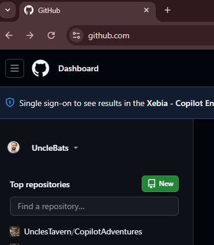
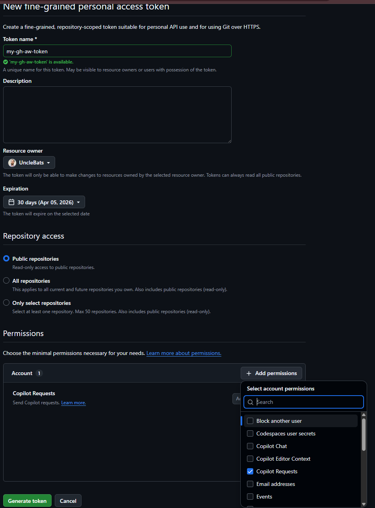
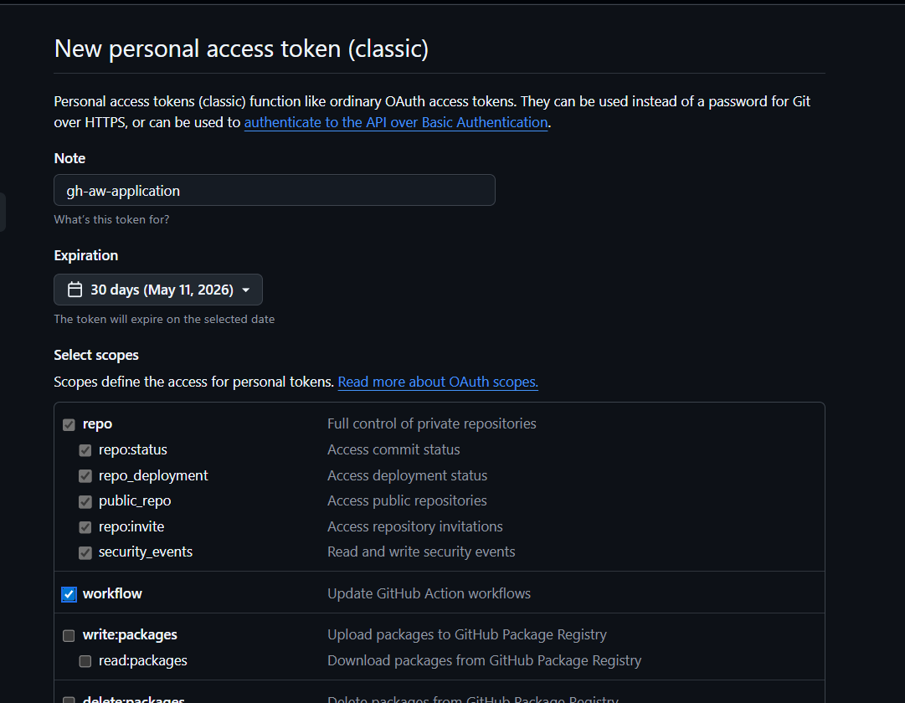

# Setup Guide

**Workshop:** From Code to Automation: Mastering GitHub Agentic Workflows  
**Duration:** 2.5+ hours  
**Date:** April 15, 2026

> 📖 **Navigation:** [← Back to Overview](participant-handout.md) | [Next: Exercise 1 →](participant-handout-exercise1.md)

---

## 📋 Prerequisites

Before starting, ensure you have:

- [ ] GitHub account (sign up at github.com)
- [ ] GitHub Copilot access (start trial at github.com/copilot)
- [ ] Laptop with admin rights to install software
- [ ] Internet connection

---

## 🛠️ Setup Commands

### 1. Install GitHub CLI

**Windows:**

```powershell
winget install --id GitHub.cli
```

**Mac:**

```bash
brew install gh
```

**Linux (Debian/Ubuntu):**

```bash
# Install from GitHub CLI repository
sudo mkdir -p -m 755 /etc/apt/keyrings
wget -qO- https://cli.github.com/packages/githubcli-archive-keyring.gpg | sudo tee /etc/apt/keyrings/githubcli-archive-keyring.gpg > /dev/null
sudo chmod go+r /etc/apt/keyrings/githubcli-archive-keyring.gpg
echo "deb [arch=$(dpkg --print-architecture) signed-by=/etc/apt/keyrings/githubcli-archive-keyring.gpg] https://cli.github.com/packages stable main" | sudo tee /etc/apt/sources.list.d/github-cli.list > /dev/null
sudo apt update
sudo apt install gh -y

# For other distributions (Fedora, Arch, etc.):
# See: https://github.com/cli/cli/blob/trunk/docs/install_linux.md
```

**Verify:**

```bash
gh --version
# Should show version 2.87.3 or higher
```

### 2. Install Extensions

```bash
# Install gh-copilot (optional but recommended)
gh extension install github/gh-copilot

# Install gh-aw (required)
gh extension install github/gh-aw

# Verify installation
gh aw --version
# Should show version v0.68.1 or higher
```

### 3. Authenticate with GitHub

```bash
gh auth login

# Follow the prompts:
# ? Where do you use GitHub? → GitHub.com
# ? What is your preferred protocol for Git operations? → HTTPS
# ? Authenticate Git with your GitHub credentials? → Yes
# ? How would you like to authenticate GitHub CLI? → Login with a web browser

# Copy the one-time code (e.g., XXXX-XXXX)
# Press Enter to open https://github.com/login/device in your browser
# Paste the code in the browser and authorize

# Expected output:
# ✓ Authentication complete.
# ✓ Logged in as <your-github-username>
```

---

## 🎯 Repository Setup

### 1. Create Your Repository on GitHub

**Note:** If you're not signed in to github.com in your web browser, sign in first.

1. Go to github.com → Click **New** (top left, next to "Top Repositories")
   
   

2. **Choose owner:** Select your GitHub user account
3. **Name:** `copilot-adventures-[yourname]`
4. **Visibility:** Public or Private (your choice)
5. **Do NOT** add README, .gitignore, or license
6. Click "Create repository"

### 2. Configure Repository Settings

**Actions Permissions:**

- Settings → Actions → General
- ✅ Allow all actions and reusable workflows
- Workflow permissions: ✅ Read and write permissions
- ✅ Allow GitHub Actions to create and approve pull requests
- **Click "Save"** to apply changes

**Enable Features:**

- Settings → General → Features
- ✅ Issues
- ✅ Discussions
- **Note:** Feature changes are applied immediately (no save button needed)

### 3. Clone and Push CopilotAdventures

```bash
# Clone Microsoft's CopilotAdventures
git clone https://github.com/microsoft/CopilotAdventures.git
cd CopilotAdventures

# Remove original remote
git remote remove origin

# Add YOUR repository as remote (replace with your username/repo)
git remote add origin https://github.com/YOUR-USERNAME/copilot-adventures-YOURNAME.git

# Push to your repository
git push -u origin main
```

### 4. Create PAT (Personal Access Token)

1. Click on your **profile icon** (top-right) → **Settings** → **Developer settings** (bottom left of the new page)
2. **Personal access tokens** → **Fine-grained tokens**
3. Click "**Generate new token**"
4. **Token name:** `Agentic Workflows Copilot Token`
5. Leave the defaults:
   - **Resource owner:** Your GitHub user account
   - **Expiration:** 30 days
   - **Repository access:** Public Repositories (only)
6. **Permissions:** Scroll down and click "**Add permission**" → Select **"Copilot Requests"**
   - This allows the user of this token to make Copilot requests on your behalf, using your premium requests and calls
   
   

7. Click "**Generate token**" → **Copy it immediately** (you won't see it again)!

```bash
# Store token as a repository action secret (paste your actual token)
gh aw secrets set COPILOT_GITHUB_TOKEN --value "YOUR_TOKEN_HERE"
```

This command stores the PAT token as a **repository action secret** in your repository. GitHub Actions workflows will use this secret to authenticate Copilot requests on your behalf.

**Verify the secret was created:**

Go to `github.com/YOUR-USERNAME/copilot-adventures-YOURNAME/settings/secrets/actions` (replace with your actual username and repo name) and you should see **COPILOT_GITHUB_TOKEN** listed there.

**Create a Classic Token for CI Trigger:**

Some agentic workflows (like the CI Coach) use `safe-outputs` to create **pull requests** that immediately trigger your CI pipeline. For this to work, the PR needs to be created with a token that has `repo` and `workflow` permissions — the fine-grained Copilot token above doesn't have these scopes.

Without this classic token, workflows can still create issues, but PRs created by the agent won't automatically trigger CI runs. You'd have to manually close and reopen the PR to kick off CI.

1. Go to **Settings** → **Developer settings** → **Personal access tokens** → **Tokens (classic)**
2. Click "**Generate new token**" → Select **"Generate new token (classic)"**
3. **Note:** `gh-aw-application`
4. **Expiration:** 30 days
5. **Select scopes:**
   - ✅ **repo** (Full control of private repositories)
   - ✅ **workflow** (Update GitHub Action workflows)

   

6. Click "**Generate token**" → **Copy it immediately**!

```bash
# Store the classic token as a repository action secret
gh aw secrets set GH_AW_CI_TRIGGER_TOKEN --value "YOUR_COPIED_TOKEN"
```

**Verify both secrets exist:**

Go to `github.com/YOUR-USERNAME/copilot-adventures-YOURNAME/settings/secrets/actions` and you should now see both:
- **COPILOT_GITHUB_TOKEN** — For Copilot AI requests
- **GH_AW_CI_TRIGGER_TOKEN** — For creating PRs that trigger CI pipelines

### 5. Add a CI Pipeline

Before we start creating agentic workflows, let's add a basic CI pipeline that builds the projects. This pipeline will be used later by the CI Coach and CI Doctor workflows to analyze and optimize.

Create a file at `.github/workflows/ci.yml` with the following content:

```yaml
name: CI

on:
  push:
    branches: [ main ]
  pull_request:
    branches: [ main ]

jobs:
  build-csharp:
    runs-on: ubuntu-latest
    steps:
      - uses: actions/checkout@v4
      
      - name: Setup .NET
        uses: actions/setup-dotnet@v4
        with:
          dotnet-version: '8.0.x'
      
      - name: Build C# Solutions
        run: dotnet build Solutions/CSharp/CopilotAdventures.sln
  
  build-javascript:
    runs-on: ubuntu-latest
    steps:
      - uses: actions/checkout@v4
      
      - name: Setup Node.js
        uses: actions/setup-node@v4
        with:
          node-version: '20'
      
      - name: Validate JavaScript Files
        run: |
          for f in Solutions/JavaScript/*.js; do node --check "$f"; done
          echo "JavaScript syntax validation passed"
  
  build-python:
    runs-on: ubuntu-latest
    steps:
      - uses: actions/checkout@v4
      
      - name: Setup Python
        uses: actions/setup-python@v5
        with:
          python-version: '3.12'
      
      - name: Validate Python Files
        run: |
          python -m py_compile Solutions/Python/*.py
          echo "Python syntax validation passed"
```

Commit and push:

```bash
git add .github/workflows/ci.yml
git commit -m "Add CI build pipeline"
git push
```

This pipeline only builds and validates syntax — no tests yet. The CI Coach (Exercise 2) will later analyze this pipeline and suggest optimizations.

---

> 📖 **Navigation:** [← Back to Overview](participant-handout.md) | [Next: Exercise 1 →](participant-handout-exercise1.md)
