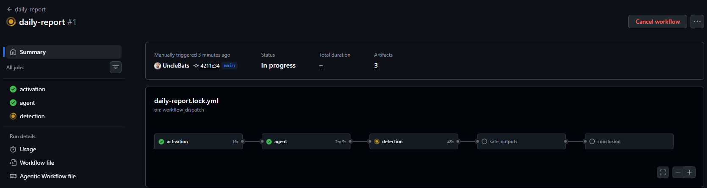

# GitHub Agentic Workflows Workshop - Participant Handout

## Quick Reference Guide

**Workshop:** From Code to Automation: Mastering GitHub Agentic Workflows  
**Duration:** 2 hours  
**Date:** [Your Event Date]

---

## 📋 Prerequisites

Before starting, ensure you have:

- [ ] GitHub account (sign up at github.com)
- [ ] GitHub Copilot access (start trial at github.com/copilot)
- [ ] Laptop with admin rights to install software
- [ ] Internet connection

---

## 🛠️ Setup Commands

### 1. Install GitHub CLI

**Windows:**

```powershell
winget install --id GitHub.cli
```

**Mac:**

```bash
brew install gh
```

**Linux (Debian/Ubuntu):**

```bash
# Install from GitHub CLI repository
sudo mkdir -p -m 755 /etc/apt/keyrings
wget -qO- https://cli.github.com/packages/githubcli-archive-keyring.gpg | sudo tee /etc/apt/keyrings/githubcli-archive-keyring.gpg > /dev/null
sudo chmod go+r /etc/apt/keyrings/githubcli-archive-keyring.gpg
echo "deb [arch=$(dpkg --print-architecture) signed-by=/etc/apt/keyrings/githubcli-archive-keyring.gpg] https://cli.github.com/packages stable main" | sudo tee /etc/apt/sources.list.d/github-cli.list > /dev/null
sudo apt update
sudo apt install gh -y

# For other distributions (Fedora, Arch, etc.):
# See: https://github.com/cli/cli/blob/trunk/docs/install_linux.md
```

**Verify:**

```bash
gh --version
# Should show version 2.87.3 or higher
```

### 2. Install Extensions

```bash
# Install gh-copilot (optional but recommended)
gh extension install github/gh-copilot

# Install gh-aw (required)
gh extension install github/gh-aw

# Verify installation
gh aw --version
# Should show version 0.51.5 or higher
```

### 3. Authenticate with GitHub

```bash
gh auth login

# Follow the prompts:
# ? Where do you use GitHub? → GitHub.com
# ? What is your preferred protocol for Git operations? → HTTPS
# ? Authenticate Git with your GitHub credentials? → Yes
# ? How would you like to authenticate GitHub CLI? → Login with a web browser

# Copy the one-time code (e.g., XXXX-XXXX)
# Press Enter to open https://github.com/login/device in your browser
# Paste the code in the browser and authorize

# Expected output:
# ✓ Authentication complete.
# ✓ Logged in as <your-github-username>
```

---

## 🎯 Repository Setup

### 1. Create Your Repository on GitHub

**Note:** If you're not signed in to github.com in your web browser, sign in first.

1. Go to github.com → Click **New** (top left, next to "Top Repositories")
   
   

2. **Choose owner:** Select your GitHub user account
3. **Name:** `copilot-adventures-[yourname]`
4. **Visibility:** Public or Private (your choice)
5. **Do NOT** add README, .gitignore, or license
6. Click "Create repository"

### 2. Configure Repository Settings

**Actions Permissions:**

- Settings → Actions → General
- ✅ Allow all actions and reusable workflows
- Workflow permissions: ✅ Read and write permissions
- ✅ Allow GitHub Actions to create and approve pull requests
- **Click "Save"** to apply changes

**Enable Features:**

- Settings → General → Features
- ✅ Issues
- ✅ Discussions
- **Note:** Feature changes are applied immediately (no save button needed)

### 3. Clone and Push CopilotAdventures

```bash
# Clone Microsoft's CopilotAdventures
git clone https://github.com/microsoft/CopilotAdventures.git
cd CopilotAdventures

# Remove original remote
git remote remove origin

# Add YOUR repository as remote (replace with your username/repo)
git remote add origin https://github.com/YOUR-USERNAME/copilot-adventures-YOURNAME.git

# Push to your repository
git push -u origin main
```

### 4. Create PAT (Personal Access Token)

1. Click on your **profile icon** (top-right) → **Settings** → **Developer settings** (bottom left of the new page)
2. **Personal access tokens** → **Fine-grained tokens**
3. Click "**Generate new token**"
4. **Token name:** `Agentic Workflows Copilot Token`
5. Leave the defaults:
   - **Resource owner:** Your GitHub user account
   - **Expiration:** 30 days
   - **Repository access:** Public Repositories (only)
6. **Permissions:** Scroll down and click "**Add permission**" → Select **"Copilot Requests"**
   - This allows the user of this token to make Copilot requests on your behalf, using your premium requests and calls
   
   

7. Click "**Generate token**" → **Copy it immediately** (you won't see it again)!

```bash
# Store token as a repository action secret (paste your actual token)
gh aw secrets set COPILOT_GITHUB_TOKEN --value "YOUR_TOKEN_HERE"
```

This command stores the PAT token as a **repository action secret** in your repository. GitHub Actions workflows will use this secret to authenticate Copilot requests on your behalf.

**Verify the secret was created:**

Go to `github.com/YOUR-USERNAME/copilot-adventures-YOURNAME/settings/secrets/actions` (replace with your actual username and repo name) and you should see **COPILOT_GITHUB_TOKEN** listed there.

---

## 📝 Workshop Exercises

### Introduction: Why Agentic Workflows?

**The Challenge:**

Imagine a team of 9 people working on a repository. Everyone is busy with their tasks, and while you generally know what your team is working on, you're never fully in touch with everything that's been completed or what's coming next. You've added daily standups and progress boards, but challenges remain:

- What happens when people have a day off?
- What if someone forgets to mention critical progress during standup?
- Who notices that PR sitting open for 2 days without a review?
- How do you track the actual state of the repository between standups?

**The Solution:**

Instead of relying solely on humans to track and communicate everything, we'll create automated assistants that work continuously in the background. These agentic workflows will:

- Generate daily summaries of real repository activity
- Monitor PRs and issues that need attention
- Provide objective data for standups and planning
- Work 24/7 without taking days off
- Never forget to check or report on important changes

**What We're Building:**

Throughout these exercises, you'll progressively build an ecosystem of intelligent automations that transform your repository into a self-organizing, self-reporting system. Each workflow adds a new capability, and together they create comprehensive visibility into your project's health and progress.

**How We're Building:**

You'll experience three different approaches to creating workflows, each with increasing quality and sophistication:

1. **Interactive CLI** (`gh aw new`) - Quick and interactive, good for learning
2. **Cloud Agent** (web browser agent tab) - Better quality by referencing documentation
3. **Repository Agent** (VS Code Copilot Chat after `gh aw init`) - Best quality with repository context

Let's start with the most fundamental need: knowing what happened in your repository each day.

---

### Exercise 1: Daily Standup Status

**Goal:** Create a workflow that generates a daily summary of repository activity to support your standup meetings.

**Method:** We'll use the interactive CLI (`gh aw new`) to learn the fundamentals of workflow creation.

**Step 1: Create the workflow**

```bash
gh aw new
```

You'll be guided through several prompts:

**1. What should we call this workflow?**
```
daily-report
```

**2. When should this workflow run?**
- Choose: `Schedule (daily, scattered execution time)`

**3. Which AI engine should process this workflow?**
- Choose: `copilot - GitHub Copilot CLI`

**4. Which tools should the AI have access to?**
- Select:
  - `github` - GitHub API tools (issues, PRs, comments, repos)
- Tools enabled:
  - `create-issue` - Create a new GitHub issue
  - `add-comment` - Add a comment to an issue, PR, or discussion
  - `close-issue` - Close a GitHub issue
  - `update-issue` - Update an existing GitHub issue

**5. Network Access Control**
- Leave defaults (no external network access needed)

**6. What should this workflow do?** (Description)
```
Run daily at 9 AM and create an issue with a summary of repository activity from past 24 hours. Include commits, pull requests, issues, and CI/CD failures.
```

**Step 2: Review the generated files**

The command creates **four files**:

1. **`daily-report.md`** - The editable source workflow in `.github/workflows/`
2. **`daily-report.lock.yml`** - The compiled GitHub Actions workflow in `.github/workflows/`
3. **`.gitattributes`** - Git configuration file in the repository root
4. **`.github/aw/actions-lock.json`** - GitHub Actions version lock file

**Understanding the files:**

**`daily-report.md`** contains:
- **Frontmatter** (YAML between `---` markers): Configuration defining triggers, permissions, and tools
- **Natural language instructions**: Your description in markdown format

**`daily-report.lock.yml`** is the compiled workflow that:
- Contains a simplified version of your prompt
- Is what GitHub Actions actually executes
- Gets regenerated when you change the `.md` file

**`.gitattributes`** contains:
```
.github/workflows/*.lock.yml linguist-generated=true merge=ours
```
This configuration:
- Marks all `.lock.yml` files as generated (excluded from language statistics)
- Sets merge strategy to `ours` (automatically resolves merge conflicts by keeping your version)

**`.github/aw/actions-lock.json`** locks GitHub Actions to specific versions and commit SHAs:
```json
{
  "entries": {
    "actions/checkout@v6.0.2": {
      "repo": "actions/checkout",
      "version": "v6.0.2",
      "sha": "de0fac2e4500dabe0009e67214ff5f5447ce83dd"
    },
    ...
  }
}
```
This file is a cache of resolved `action@version` → commit SHA mappings. During workflow compilation, the compiler tries to pin each action reference to an immutable commit SHA for security. The cache avoids problems when compiling with limited-permission tokens (like GitHub Copilot Coding Agent) that may not have access to resolve external repositories. Without this cache, compilation can be unstable—succeeding with a permissive token but failing when token access is restricted. Commit this file to version control so all contributors use consistent action references.

📚 **Learn more:** [What is the actions-lock.json file?](https://github.github.com/gh-aw/reference/faq/#what-is-the-actions-lockjson-file)

📚 **Learn more:** [How Agentic Workflows Work](https://github.github.com/gh-aw/introduction/how-they-work/)

**Step 3: Observe the limitation**

Open `.github/workflows/daily-report.md` and look at the prompt. It's very basic - just your description. This works, but we can achieve much better results.

**Why this matters:** The quality of the AI's output depends heavily on the quality and detail of the instructions. The simple interactive CLI creates a minimal prompt, which means the workflow might:
- Miss important details
- Not format output consistently
- Lack error handling
- Be less reliable

**What's next:** In the following exercises, we'll use more sophisticated approaches that generate better prompts and higher-quality workflows.

**Step 4: Commit and test**

```bash
# Review the generated files or view in your code editor
cat .github/workflows/daily-report.md
cat .github/workflows/daily-report.lock.yml

# Commit all files
git add .
git commit -m "Add daily report workflow (basic version)"
git push
```

**Step 5: Manually trigger to test**

Since it's scheduled for daily execution, trigger it manually to see it work:

1. Go to your repository on GitHub
2. Click **Actions** tab
3. Select **daily-report** workflow
4. Click **Run workflow** button
5. Watch it execute



**Understanding the workflow execution:**

The workflow runs through **5 distinct phases**:

1. **activation** (✅ ~16s) - Sets up the workflow environment, checks out the repository code, and prepares the runtime
2. **agent** (✅ ~2m) - The AI agent analyzes your repository, reads commits, PRs, and issues from the past 24 hours, and formulates a summary
3. **detection** (🟡 ~45s) - Validates the agent's output to ensure it's properly formatted and safe to process
4. **safe_outputs** (⚪ pending) - **This is the automation step** that interprets the JSON output from the agent and creates the actual issue in your repository
5. **conclusion** (⚪ pending) - Finalizes the workflow and cleans up

**Important:** The agent itself doesn't directly create issues, PRs, or comments. Instead, it produces **structured JSON output** that describes what should be created. The `safe_outputs` step then interprets this JSON and performs the actual GitHub API calls to create the issue. This separation ensures security and allows for validation before any changes are made to your repository.

---

### Exercise 2: CI Coach

**Why: Building the Backbone of Your DevOps Practice**

Now that you have visibility into daily activity, let's focus on the backbone of your validation system: your **Continuous Integration (CI) pipeline**.

Your CI pipeline is critical because it:
- **Triggers on each change** - Every commit, every PR gets validated
- **Validates each update** - Runs tests, checks code quality, enforces standards
- **Deploys to customers** - When successful, it puts your work in users' hands

As a team improving your DevOps practices, you need guardrails before letting AI run fully agentic. A healthy CI pipeline is non-negotiable because you want it to be:
- **Quick enough** - Fast feedback means you can wait for results and fix issues immediately
- **Consistent enough** - It's your single source of truth for "is this ready?"
- **Complete enough** - Tests all scenarios so you ship with confidence

**The challenge:** Teams often set up CI once and then the codebase evolves without the pipeline keeping pace. New dependencies get added, test patterns change, edge cases emerge - but the CI configuration stays static. You need constant validation that your pipeline is keeping up with your code.

**What: A CI Coach That Has Your Back**

The CI Coach workflow provides:
- **Proactive guidance** - Catches issues before CI runs, saving time
- **Evolutionary awareness** - Notices when your codebase has evolved beyond your current CI setup
- **Continuous nudges** - Suggests improvements as patterns emerge
- **Early warnings** - Spots potential failures before they happen

Instead of waiting for CI to fail and then reacting, you get coaching on every PR that helps you maintain a world-class pipeline.

**How: Create Your CI Coach**

**Method:** We'll use the cloud agent (web browser) which produces better quality workflows by referencing documentation.

**Step 1: Create the workflow using the cloud agent**

1. Go to your repository on GitHub.com in your web browser
2. Click on the **Agent** tab
3. Provide this prompt to the agent:

```
Create a workflow for GitHub Agentic Workflows using https://raw.githubusercontent.com/github/gh-aw/main/create.md

The purpose of the workflow is to act as a CI Coach that runs when a pull request is opened or updated. It should:
1. Analyze the code changes for potential CI/CD issues
2. Check if tests are likely to pass
3. Look for common mistakes (missing dependencies, syntax issues, breaking changes)
4. Comment on the PR with proactive suggestions before CI runs
5. Be encouraging and helpful in tone

Use the pull_request trigger and comment on PRs using safe-outputs.
```

**Step 2: Review and merge the generated PR**

The cloud agent creates a **Pull Request** with the workflow files. 

1. Go to your repository on GitHub → **Pull Requests** tab
2. Review the PR created by the agent (titled something like "Add CI Coach workflow")
3. Verify the workflow files look correct:
   - `.github/workflows/ci-coach.md` (source workflow)
   - `.github/workflows/ci-coach.lock.yml` (compiled workflow)
4. **Merge the PR to main**

**Step 3: Manually trigger the CI Coach**

Since the CI Coach triggers on pull requests, let's test it manually first:

1. Go to your repository → **Actions** tab
2. Select **ci-coach** workflow (or similar name)
3. Click **Run workflow** button → Run workflow
4. Watch it execute

**Step 4: Check the outcome**

After the workflow completes, check your repository:

**Question to consider:** Did you receive a:
- 📝 **Pull Request** with suggested changes?
- 💬 **Discussion** post with recommendations?
- 🎯 **Issue** with analysis and suggestions?

**Important:** You can configure how the CI Coach communicates with you! The workflow can be set to create PRs for actionable changes, issues for recommendations, or discussions for general feedback. 

Which format do you prefer for receiving CI coaching feedback? Think about:
- PRs = Immediate actionable changes ready to review
- Issues = Trackable recommendations you can prioritize
- Discussions = Conversational feedback for team consideration

**Key Insight:** The CI Coach doesn't just check syntax—it analyzes your repository's testing infrastructure and identifies opportunities for improvement. It recognizes when your codebase has evolved beyond your current CI setup and provides specific, measurable recommendations to keep your pipeline aligned with your code.

This continuous feedback strengthens your guardrails as you prepare for more autonomous workflows.

---

### Exercise 3: CI Doctor

**Why: Eliminating Context Switches and Constant Monitoring**

Think about your team's current workflow when something breaks in CI:
- Someone gets a notification (often at an inconvenient time)
- They stop their current work to investigate
- They dig through logs to find the root cause
- They search for similar issues or fixes
- They create a fix and submit it

**The challenge:** This constant context switching is expensive. Every time someone stops feature work to fix a CI failure, you lose momentum, focus, and productivity. Your team can't scale if everyone needs to be on alert for CI failures.

**What: An Automated CI Diagnostician**

Instead of your team monitoring workflows and context switching when things break, the CI Doctor workflow:
- **Activates automatically** when any workflow fails
- **Analyzes failure logs** to identify root causes
- **Searches repository history** for similar issues and past solutions
- **Suggests remediation** in a PR ready for review
- **Works 24/7** without human monitoring needed

This shifts your team from **reactive firefighting** to **proactive pipeline maintenance**. The CI Doctor handles the diagnosis and suggests the fix - you just review and approve.

**How: Create Your CI Doctor**

**Method:** We'll use the cloud agent again for consistent, high-quality workflow generation.

**Step 1: Create the workflow using the cloud agent**

1. Go to your repository on GitHub.com in your web browser
2. Click on the **Agent** tab
3. Provide this prompt to the agent:

```
Create a workflow for GitHub Agentic Workflows using https://raw.githubusercontent.com/github/gh-aw/main/create.md

The purpose of the workflow is to act as a CI Doctor that runs when a workflow_run fails. It should:
1. Analyze the failure logs
2. Identify the root cause
3. Search for similar issues in the repository history
4. Create a detailed issue with:
   - Failure summary
   - Root cause analysis
   - Suggested fixes
   - Links to relevant documentation
5. If the fix is simple (dependency update, typo), attempt to create a PR

Use the workflow_run trigger with completed status and failure conclusion.
```

**Step 2: Review and merge the generated PR**

The cloud agent creates a PR with the CI Doctor workflow files.

1. Go to your repository → **Pull Requests** tab
2. Review the PR (titled something like "Add CI Doctor workflow")
3. Verify the workflow files:
   - `.github/workflows/ci-doctor.md`
   - `.github/workflows/ci-doctor.lock.yml`
4. **Merge the PR to main**

**Step 3: Introduce a failing test to trigger the CI Doctor**

To see the CI Doctor in action, we need a CI failure. Let's intentionally break a test:

1. Create a new branch for the test failure:

```bash
git checkout -b test/trigger-ci-doctor
```

2. In your repository, navigate to `Solutions/JavaScript/The-Gridlock-Arena-of-Mythos/The-Gridlock-Arena-of-Mythos.test.js`

3. Find the `testIsValidPosition()` function (around line 214)

4. Add a failing assertion at the end of the function:

```javascript
// Add this line to intentionally fail the test
assert(false, 'Intentional test failure to trigger CI Doctor');
```

5. Commit, push, and create a pull request:

```bash
git add Solutions/JavaScript/The-Gridlock-Arena-of-Mythos/The-Gridlock-Arena-of-Mythos.test.js
git commit -m "Test: Intentionally break test to trigger CI Doctor"
git push -u origin test/trigger-ci-doctor

# Create a PR using GitHub CLI
gh pr create --title "Test: Trigger CI Doctor" --body "Intentionally breaking a test to demonstrate the CI Doctor workflow"
```

**Step 4: Watch the CI Doctor work**

1. Go to your repository → **Actions** tab
2. You'll see the test workflow fail (red ❌)
3. Shortly after, the CI Doctor workflow will trigger automatically
4. Check your repository for:
   - A new **issue** with diagnosis and suggested fixes, or
   - A new **pull request** with a proposed fix

**Step 5: Review the diagnosis**

The CI Doctor will analyze the failure and might provide:
- The exact line causing the failure
- Context about what the test expected vs. what it got
- Suggestions for fixing the issue
- Links to similar past issues or documentation

**Step 6: Fix and restore**

Once you've seen the CI Doctor in action, close the test PR and clean up:

```bash
# Close the PR (from your main branch)
git checkout main
gh pr close test/trigger-ci-doctor

# Delete the test branch
git branch -D test/trigger-ci-doctor
git push origin --delete test/trigger-ci-doctor
```

**Key Insight:** The CI Doctor eliminates the need for constant human monitoring of your pipelines. When failures occur, you get automated diagnosis and suggested fixes instead of scrambling to debug logs. This keeps your team focused on building features while maintaining pipeline health.

Your DevOps guardrails are now stronger: you have visibility (Exercise 1), proactive coaching (Exercise 2), and automated diagnosis (Exercise 3). These workflows work together to keep your repository healthy with minimal human intervention.

---

### Exercise 4: Continuous Test Updates

**Why: Building a Strong Test Foundation Over Time**

Every engineering team knows tests are important, but writing comprehensive test coverage is:
- **Time-consuming** - Tests often take longer to write than the code itself
- **Tedious** - Repetition and boilerplate make it feel like busywork
- **Deprioritized** - "We'll add tests later" often means "We'll never add tests"
- **Overwhelming** - The idea of achieving 80%+ coverage feels impossible

**The challenge:** Teams that try to "catch up" on test coverage in one big initiative often fail. Developers spend weeks writing tests instead of features, morale drops, and the initiative stalls. Meanwhile, untested code becomes technical debt that protects against faulty changes.

**What: Gradual, Sustainable Test Growth**

Instead of a massive test-writing initiative, the Continuous Test Updates workflow:
- **Works incrementally** - Just 3 tests per day, every day
- **Creates manageable PRs** - Easy to review, not overwhelming
- **Learns from your patterns** - Follows existing test conventions in your repository
- **Accumulates steadily** - 3 tests/day = ~1,000 tests/year
- **Focuses strategically** - Identifies files with missing or inadequate coverage

This approach transforms test coverage from a daunting task into a sustainable background process. You review and accept (or pivot on) small batches of tests, and over time your foundation becomes solid without disrupting feature work.

**How: Create Your Continuous Test Updater**

**Method:** We'll use the cloud agent for consistent quality.

**Step 1: Create the workflow using the cloud agent**

1. Go to your repository on GitHub.com in your web browser
2. Click on the **Agent** tab
3. Provide this prompt to the agent:

```
Create a workflow for GitHub Agentic Workflows using https://raw.githubusercontent.com/github/gh-aw/main/create.md

The purpose of the workflow is to continuously improve test coverage. It should run daily and:
1. Analyze the codebase to find 3 files with missing or inadequate tests
2. Generate meaningful unit tests for those files
3. Ensure tests follow the existing test conventions in the repository
4. Create a pull request with the new tests
5. Limit to 3 test additions per day to keep PRs manageable

The workflow should work across C#, JavaScript, and Python files in the Solutions/ directory.

Use a daily schedule trigger and create PRs with safe-outputs.
```

**Step 2: Review and merge the generated PR**

The cloud agent creates a PR with the workflow files.

1. Go to your repository → **Pull Requests** tab
2. Review the PR (titled something like "Add Continuous Test Updates workflow")
3. Verify the workflow files:
   - `.github/workflows/continuous-test-updates.md`
   - `.github/workflows/continuous-test-updates.lock.yml`
4. **Merge the PR to main**

**Step 3: Manually trigger the workflow**

Since this runs on a daily schedule, trigger it manually to see it work immediately:

1. Go to your repository → **Actions** tab
2. Select the **continuous-test-updates** workflow (or similar name)
3. Click **Run workflow** button → Run workflow
4. Watch it execute (this may take a few minutes as it analyzes your codebase)

**Step 4: Review the test suggestions**

After the workflow completes, check your repository for:
- A new **pull request** with proposed tests, or
- A new **issue** with test recommendations

The workflow will:
- Identify specific files that need better test coverage
- Generate tests that match your existing test patterns
- Follow naming conventions already in your codebase
- Create meaningful test cases (not just empty scaffolding)

**Example output you might see:**
- New tests for edge cases in existing functions
- Tests for recently added code that lacks coverage
- Validation tests for input handling
- Integration tests for key workflows

**Step 5: Review and iterate**

When reviewing the proposed tests:
- ✅ **Accept** tests that add value and follow good practices
- 🔄 **Request changes** if tests need adjustment
- ❌ **Close** if the tests aren't relevant (the workflow will try different files next time)

**Key Insight:** By generating 3 tests per day, you build robust test coverage without disrupting feature development. Over weeks and months, this creates a strong validation foundation that protects against faulty changes and enables more confident automation. Better tests mean better AI outcomes - the more validation you have, the safer it is to let AI make autonomous changes.

Your DevOps practices now include proactive quality improvement: visibility (Exercise 1), coaching (Exercise 2), diagnosis (Exercise 3), and continuous validation growth (Exercise 4). These workflows compound over time, each making your repository healthier and your team more productive.

---

### Exercise 5: Initialize Repository Agent

**Why: Bringing Automation into Your Development Workflow**

So far, you've created workflows using:
- **Interactive CLI** (Exercise 1) - Command-line, no repository context
- **Cloud Agent** (Exercises 2-4) - Browser-based on GitHub.com, has repository context

Both work well, but there's a workflow consideration: you need to **switch contexts** between your development environment and the browser to create workflows.

**The challenge:** Most developers spend their time in their IDE (like VS Code), not on GitHub.com. When you need to create or modify a workflow, you have to:
- Stop what you're coding
- Open your browser
- Navigate to GitHub.com
- Use the agent tab
- Copy the generated workflow back
- Return to your IDE

This context switching adds friction. The more friction in the process, the less likely you are to create automation when you need it.

**What: Repository Agent in Your IDE**

Initializing agentic workflows in your repository enables a new capability: **repository agents directly in VS Code Copilot Chat**. This means:
- **Stay in your IDE** - No need to switch to the browser
- **Faster workflow creation** - Agent is right where you're coding
- **Immediate testing** - Generate, save, commit, and test without leaving VS Code
- **Integrated development** - Part of your natural coding flow
- **Same repository context** - Just like the cloud agent, but in your tool

This removes friction from automation creation. When you think "I should automate this," you can do it immediately without breaking your flow.

**How: Install Repository Tooling**

**Method:** Initialize agentic workflows and commit the configuration as a PR.

**Step 1: Create a branch and initialize**

```bash
# Create a branch for this configuration
git checkout -b config/initialize-agentic-workflows

# Initialize agentic workflows in your repository
gh aw init

# This creates .github/aw/ directory with configuration
# Review what was created
ls -la .github/aw/
```

**Step 2: Commit and create a PR**

```bash
# Add the configuration files
git add .github/aw/

# Commit with a clear message
git commit -m "Initialize GitHub Agentic Workflows"

# Push the branch
git push -u origin config/initialize-agentic-workflows

# Create a PR
gh pr create --title "Initialize Agentic Workflows" --body "Setting up repository agent configuration to enable context-aware workflow creation in VS Code"
```

**Step 3: Review and merge the PR**

1. Go to your repository → **Pull Requests** tab
2. Review the PR with the `.github/aw/` configuration
3. **Merge the PR to main**
4. Return to your local main branch:

```bash
git checkout main
git pull origin main
```

**Step 4: Test the repository agent in VS Code**

Now you can use GitHub Copilot Chat with repository context directly in your IDE:

1. **Create a new branch for the workflow:**

```bash
git checkout -b workflow/agents-md-maintenance
```

2. **Open VS Code Copilot Chat**
3. Type `/agents` to view available agents
4. Select the **agentic-workflows** agent from the UI
5. Test it with this prompt:

```
create a workflow that keeps the AGENTS.md file up to date.

It should run weekly, review merged pull requests and updated source files since the last run, then open a pull request that keeps AGENTS.md accurate and current.
```

6. The agent generates the workflow right in VS Code with full repository context

**Step 5: Compile, commit, and create PR**

Notice how seamless this is - you stayed in your IDE the entire time:

```bash
# Save the generated workflow file (e.g., .github/workflows/agents-md-maintenance.md)
# The agent will have created the .md file with your workflow

# Compile the workflow to create the lock file
gh aw compile .github/workflows/agents-md-maintenance.md

# This creates .github/workflows/agents-md-maintenance.lock.yml

# Add both files
git add .github/workflows/agents-md-maintenance.md .github/workflows/agents-md-maintenance.lock.yml

# Commit with a clear message
git commit -m "Add AGENTS.md maintenance workflow"

# Push the branch
git push -u origin workflow/agents-md-maintenance

# Create a PR
gh pr create --title "Add AGENTS.md maintenance workflow" --body "Automated workflow to keep AGENTS.md documentation current with repository changes"
```

**Step 6: Review and merge the PR**

1. Go to your repository → **Pull Requests** tab
2. Review the PR with the new workflow
3. **Merge the PR to main**
4. Return to your local main branch:

```bash
git checkout main
git pull origin main
```

**Step 7: Test the AGENTS.md updater**

Now let's see the workflow in action. It should analyze all the recent PRs you've merged (CI Coach, CI Doctor, Test Updater, and the initialization) and update AGENTS.md accordingly.

1. Go to your repository → **Actions** tab
2. Select the **agents-md-maintenance** workflow (or similar name)
3. Click **Run workflow** button → Run workflow
4. Watch it execute

The workflow will:
- Review merged pull requests since the last run
- Analyze the workflows you've added (daily-report, ci-coach, ci-doctor, continuous-test-updates)
- Update AGENTS.md with descriptions of these new workflows
- Create a PR with the updated documentation

**Step 8: Review the generated documentation**

After the workflow completes:
1. Check for a new PR titled something like "Update AGENTS.md documentation"
2. Review how the workflow documented your recent changes
3. Notice it understands the purpose and context of each workflow you added
4. Merge the PR to keep your documentation current

**Key Insight:** The best automation is automation you actually create. By putting the agent directly in your development environment, you remove friction from the workflow creation process. When it's easy to automate, you automate more. This makes the repository agent the most practical method for ongoing workflow development.

You've now unlocked IDE-integrated workflow creation - use it for all remaining exercises.

---

### Exercise 6: Issue Triage (Reusing Proven Workflows)

**Why: Don't Build What Others Have Perfected**

You've built several workflows from scratch (Exercises 1-5), which is essential for learning the fundamentals. But in real practice, why reinvent the wheel when proven solutions exist?

**The challenge:** Building workflows from scratch means:
- **Trial and error** - You'll discover edge cases the hard way
- **Missing features** - You might not think of all the capabilities you need
- **Maintenance burden** - You own all the bugs and improvements
- **Reinventing** - Others have solved these problems and worked out the kinks

**The opportunity:** The community has built and battle-tested workflows for common needs. Key sources include:
- **https://github.com/githubnext/agentics/** - Curated, production-ready workflows
- **https://github.com/github/gh-aw** - Official examples and patterns
- **https://github.com/github/awesome-copilot** - Community contributions

**What: Issue Triage - Intelligent First Responder**

The `issue-triage` workflow from githubnext/agentics is a focused, battle-tested assistant that runs automatically when issues are opened or reopened. It provides intelligent first-response triage:

**Analyzes Issues Thoroughly:**
- Fetches issue content and comments
- Searches for similar issues to detect duplicates
- Reviews other open issues for context
- Identifies spam or bot-generated issues

**Provides Smart Labeling:**
- Selects appropriate labels from your repository's label list
- Identifies issue type (bug, feature request, question, etc.)
- Assigns priority labels (high, medium, low) based on severity
- Marks duplicates of **open** issues only (not closed ones)

**Delivers Actionable Analysis:**
- Adds structured comment starting with "🎯 Agentic Issue Triage"
- Provides brief summary of the issue
- Suggests debugging strategies and reproduction steps
- Links to relevant resources and documentation
- Breaks down complex issues into sub-task checklists
- Uses collapsed sections to keep comments tidy

**Respects Human Input:**
- Doesn't spam or over-communicate
- Only adds labels when clearly applicable
- Exits early for obvious spam without noise

**How: Add the Community Workflow**

**Method:** Use `gh aw add` to install a proven community workflow.

**Step 1: Create a branch for the addition**

```bash
git checkout -b workflow/add-issue-triage
```

**Step 2: Add the issue-triage workflow**

```bash
# Add the workflow from the githubnext/agentics repository
gh aw add githubnext/agentics/issue-triage

# This downloads issue-triage.md and compiles it to issue-triage.lock.yml
```

**Step 3: Review what was added**

```bash
# Check the workflow file
cat .github/workflows/issue-triage.md

# Note the 8-step triage process defined in the workflow
```

**Step 4: Commit and create PR**

```bash
# Add both the source and compiled workflow
git add .github/workflows/issue-triage.md .github/workflows/issue-triage.lock.yml

# Commit with context
git commit -m "Add issue-triage workflow from githubnext/agentics"

# Push the branch
git push -u origin workflow/add-issue-triage

# Create a PR
gh pr create --title "Add Issue Triage workflow" --body "Installing the community-proven issue-triage workflow to automatically analyze, label, and provide helpful context for new issues"
```

**Step 5: Review and merge the PR**

1. Go to your repository → **Pull Requests** tab
2. Review the PR with the issue-triage workflow
3. **Merge the PR to main**
4. Return to your local main branch:

```bash
git checkout main
git pull origin main
```

**Step 6: Test with a new issue**

Let's trigger the issue-triage workflow:

1. **Create a test issue** on your repository:
   - Title: `Add Ruby adventure support`
   - Body: 
     ```
     Currently we have the Python, C# and Javascript. Add a new Ruby adventure to it following the same guidelines as the other languages
     ```

2. **Watch GitHub pick it up:**
   - Notice the 👀 eye emoji icons appear on the issue (this indicates the workflow is processing it)
   - Go to **Actions** tab
   - Find the "issue-triage" workflow run
   - Observe how it processes the new issue

**Step 7: Review the triage output**

After the workflow completes (usually ~1-2 minutes):
1. Return to the issue you created
2. Check the labels that were automatically applied (likely `enhancement` or `feature`)
3. Read the **🎯 Agentic Issue Triage** comment:
   - Does it correctly identify this as a feature request?
   - Did it provide helpful context about the repository?
   - Did it suggest next steps or break down the work?
   - Did it reference similar work in the repository?

**Key Insight:** Reusing proven workflows means you get battle-tested solutions immediately, benefit from community improvements, and avoid common pitfalls. The githubnext/agentics library contains workflows refined through real-world usage across many repositories. By standing on the shoulders of giants, you accelerate from "learning the basics" to "running production-quality automation."

---

### Exercise 7: Feature Planning (Reusing Proven Workflows)

**Why: From Big Ideas to Actionable Tasks**

In Exercise 6, issue-triage gave us a first analysis of the Ruby adventure request. But a high-level feature request like "Add Ruby support" is too large for a single implementation. Breaking it down manually is tedious and error-prone.

**The challenge:** Complex features need decomposition:
- **Manual breakdown is time-consuming** - Thinking through all the steps takes mental energy
- **Easy to miss dependencies** - What needs to happen first? What depends on what?
- **Inconsistent granularity** - Some tasks too large, others too small
- **Hard to parallelize** - Unclear what can be done simultaneously

**The opportunity:** The `/plan` command workflow can analyze any issue and break it into a sequence of clear, actionable sub-issues (up to 5) that are perfectly sized for implementation.

**What: Plan - Intelligent Task Breakdown**

The `plan` workflow from githubnext/agentics is a specialized planning assistant that:

**Analyzes the Request:**
- Reads issue title, description, and all comments
- Determines overall scope and complexity
- Identifies logical work items
- Considers dependencies between tasks

**Creates Sub-Issues with Structure:**
- **Objective:** What needs to be done
- **Context:** Why this is needed and how it relates to the parent issue
- **Approach:** Suggested implementation steps
- **Files:** Specific files to create or modify
- **Acceptance Criteria:** Checklist to verify completion

**Follows Best Practices:**
- **Proper sequencing:** Foundation → Implementation → Validation
- **Right granularity:** Each task completable in a single PR
- **SWE agent-ready:** Written with imperative language for clear execution
- **Automatic linking:** Sub-issues reference the parent issue
- **Maximum 5 tasks:** Keeps scope manageable

**Example sub-issue:**
> **Title:** Add user authentication middleware
> 
> **Objective:** Implement JWT-based authentication middleware for API routes.
> 
> **Context:** This is needed to secure API endpoints before implementing user-specific features. Part of issue #123.
> 
> **Files to Modify:**
> - Create: `src/middleware/auth.js`
> - Update: `src/routes/api.js` (to use the middleware)
> - Update: `tests/middleware/auth.test.js` (add tests)
> 
> **Acceptance Criteria:**
> - [ ] Middleware validates JWT tokens
> - [ ] Invalid tokens return 401 status
> - [ ] Tests cover success and error cases

**How: Add the Planning Workflow**

**Method:** Use `gh aw add` to install the community planning workflow.

**Step 1: Create a branch for the addition**

```bash
git checkout -b workflow/add-plan
```

**Step 2: Add the plan workflow**

```bash
# Add the workflow from the githubnext/agentics repository
gh aw add githubnext/agentics/plan

# This downloads plan.md and compiles it to plan.lock.yml
```

**Step 3: Review what was added**

```bash
# Check the workflow file
cat .github/workflows/plan.md

# Note the planning assistant guidelines and task breakdown process
```

**Step 4: Commit and create PR**

```bash
# Add both the source and compiled workflow
git add .github/workflows/plan.md .github/workflows/plan.lock.yml

# Commit with context
git commit -m "Add plan workflow from githubnext/agentics"

# Push the branch
git push -u origin workflow/add-plan

# Create a PR
gh pr create --title "Add Plan workflow" --body "Installing the community-proven plan workflow to break down features into actionable sub-issues"
```

**Step 5: Review and merge the PR**

1. Go to your repository → **Pull Requests** tab
2. Review the PR with the plan workflow
3. **Merge the PR to main**
4. Return to your local main branch:

```bash
git checkout main
git pull origin main
```

**Step 6: Test with the Ruby issue from Exercise 6**

Now let's use the plan workflow on the "Add Ruby adventure support" issue we created in Exercise 6:

1. **Navigate to the Ruby issue:**
   - Go to your repository → **Issues** tab
   - Find the issue titled "Add Ruby adventure support"
   - Open it

2. **Trigger the plan workflow:**
   - Scroll to the bottom (comment section)
   - Add a **new comment** (not an edit of existing comment):
     ```
     /plan
     ```
   - **Important:** Must be a new comment, editing won't trigger the workflow
   - **Important:** Just `/plan` - don't assign to Copilot (that does something different!)

3. **Watch the workflow run:**
   - Go to **Actions** tab
   - Find the "Plan Command" workflow run
   - Observe how it processes the issue

**Step 7: Review the generated sub-issues**

After the workflow completes (usually ~1-2 minutes):

1. **Return to the Ruby issue:**
   - Check for new sub-issues created
   - They should appear in the issue's "Related" or "Linked issues" section

2. **Review each sub-issue:**
   - Notice the structured format: Objective, Context, Approach, Files, Acceptance Criteria
   - Check the sequencing: Does it make logical sense?
   - Verify granularity: Can each be completed in a single PR?

3. **Expected sub-issues might include:**
   - Set up Ruby project structure and dependencies
   - Implement Ruby solution for Adventure 1
   - Implement Ruby solution for Adventure 2
   - Add Ruby-specific README and setup instructions
   - Add Ruby to CI/CD pipeline for validation

**Step 8 (Optional): Assign a sub-issue to Copilot for automatic implementation**

Now that you have well-structured sub-issues, you can let Copilot implement them automatically:

1. **Select one of the generated sub-issues:**
   - Choose a sub-issue that's well-defined and has clear acceptance criteria
   - Start with a simpler task for your first test

2. **Assign to Copilot:**
   - Open the sub-issue on GitHub
   - In the issue comment section, type:
     ```
     assign: copilot
     ```
   - Post the comment

3. **Watch Copilot Cloud work:**
   - Copilot Cloud picks up the assignment automatically
   - It reads the issue's Objective, Context, Approach, and Acceptance Criteria
   - Creates a new branch for the implementation
   - Writes the code based on the specification
   - Runs tests if applicable
   - Opens a PR with the implementation

4. **Review the PR:**
   - Go to **Pull Requests** tab
   - Find the PR created by Copilot
   - Review the implementation against the acceptance criteria
   - Request changes if needed, or merge if it looks good

**Note:** This demonstrates the full workflow automation cycle: issue triage → planning → automatic implementation. Each sub-issue becomes a self-contained work package that Copilot can execute autonomously.

**Key Insight:** The `/plan` command transforms vague feature requests into executable work packages. Each sub-issue is ready for implementation, properly sequenced, and sized for a single PR. This workflow eliminates the manual planning overhead and ensures consistent quality in task breakdown across your team.

---

### Exercise 8: Implementation Workflow

**Use VS Code Copilot Chat with repository agent:**

1. Type `/agents` and select agentic-workflows agent
2. Use this prompt:

```
create a workflow that triggers when someone comments "/implement" on an issue. The workflow should:

1. Read the issue description and any plans
2. Create a new branch for the feature
3. Implement the first task in the plan
4. Run tests to verify it works
5. Create a draft pull request
6. Comment back on the original issue with progress

This enables iterative development triggered by humans.
```

**Then test it:**

- Comment `/implement` on the Ruby issue
- Watch the workflow create a branch and start implementation

---

### Exercise 9: Reuse Workflows

```bash
# Add a workflow from the community library
gh aw add githubnext/agentics/continuous-documentation-updates

# Review what was added
cat .github/workflows/continuous-documentation-updates.yml

# Commit
git add .github/workflows/continuous-documentation-updates.yml
git commit -m "Add continuous documentation updates"
git push
```

---

### Exercise 10: Workflow Maintenance

**Use VS Code Copilot Chat with repository agent:**

1. Type `/agents` and select agentic-workflows agent
2. Use this prompt:

```
create a workflow called "agentics-maintenance" that:

1. Runs weekly
2. Checks if any workflows in our repository were imported from githubnext/agentics
3. Compares our versions to the latest versions in the remote repository
4. If updates are available:
   - Creates a branch
   - Updates the workflows
   - Runs tests to ensure compatibility
   - Creates a PR with changelog of what changed
5. Labels PR as "dependencies" and "workflows"

This keeps our imported workflows up to date automatically.
```

**Save and commit:** `.github/workflows/agentics-maintenance.yml`

---

## 🎯 Useful Commands

### View Workflows

```bash
# List all workflows
gh workflow list

# View workflow runs
gh run list

# View specific run
gh run view <run-id>

# Watch a running workflow
gh run watch
```

### Manage Secrets

```bash
# Verify required secrets are configured
gh aw secrets bootstrap

# Set a secret
gh aw secrets set SECRET_NAME --value "secret-value"
```

### Workflow Management

```bash
# Validate workflows
gh aw validate

# Update gh-aw extension
gh extension upgrade gh-aw

# View gh-aw help
gh aw --help
```

---

## 🔥 Troubleshooting

### Common Issues

**`gh aw` command not found**

```bash
gh extension install github/gh-aw
gh extension list  # Verify installation
```

**Workflow not triggering**

- Check Settings → Actions → Permissions
- Ensure read/write permissions enabled
- Verify workflow YAML is valid

**COPILOT_GITHUB_TOKEN errors**

- Regenerate token with proper permissions
- Ensure token has "Copilot" scope
- Check token hasn't expired

**PR not created by workflow**

- Settings → Actions → Workflow permissions
- Enable "Allow GitHub Actions to create and approve pull requests"

**Authentication fails**

```bash
gh auth refresh
# Or logout and login again
gh auth logout
gh auth login
```

---

## 📚 Resources

### Documentation

- **GitHub Agentic Workflows:** https://github.github.com/gh-aw/
- **Quick Start Guide:** https://github.github.com/gh-aw/setup/quick-start/
- **How It Works:** https://github.github.com/gh-aw/introduction/how-they-work/
- **Security Architecture:** https://github.github.com/gh-aw/introduction/architecture/

### Community

- **Peli's Agent Factory:** https://github.github.com/gh-aw/blog/2026-01-12-welcome-to-pelis-agent-factory/
- **Community Discussions:** https://github.com/orgs/community/discussions/186451
- **GitHub Next Discord:** https://gh.io/next-discord
- **Workflow Library:** https://github.com/githubnext/agentics

### CopilotAdventures

- **Main Repository:** https://github.com/microsoft/CopilotAdventures
- **Adventures:** Educational coding challenges in multiple languages
- **Contribute:** Follow CONTRIBUTING.md guidelines

---

## 💡 Tips & Best Practices

### Security

- ✅ Start with read-only workflows
- ✅ Use safe-outputs for all writes
- ✅ Review all AI-generated PRs before merging
- ✅ Set spending limits on GitHub Actions
- ✅ Never commit tokens or secrets
- ✅ Use fine-grained PATs with minimal permissions

### Workflow Design

- ✅ Start simple, add complexity gradually
- ✅ Be descriptive in workflow prompts
- ✅ Reference documentation URLs for better results
- ✅ Test workflows on private repos first
- ✅ Use meaningful workflow names
- ✅ Add comments explaining workflow purpose

### Maintenance

- ✅ Monitor workflow runs regularly
- ✅ Update workflows when patterns improve
- ✅ Archive workflows you're not using
- ✅ Keep documentation in sync with workflows
- ✅ Version control all changes
- ✅ Use workflow maintenance automation

---

## 🎓 What You've Learned

By completing this workshop, you now know how to:

- [x] Install and configure GitHub Agentic Workflows
- [x] Create workflows using three different methods (CLI, Cloud, Repository Agent)
- [x] Implement continuous improvement patterns
- [x] Automate issue management and triage
- [x] Use `/plan` for feature breakdown
- [x] Trigger workflows from comments
- [x] Reuse workflows from other repositories
- [x] Maintain workflows automatically
- [x] Apply security guardrails
- [x] Build self-organizing repository systems

---

## 🚀 Next Steps

### Immediate (This Week)

- Experiment with your CopilotAdventures repository
- Add one workflow to a personal project
- Join the GitHub Next Discord community
- Share your workflows in GitHub Discussions

### Short Term (This Month)

- Propose agentic workflows to your team
- Build a workflow library for your organization
- Contribute workflows to githubnext/agentics
- Help others in the community

### Long Term (This Year)

- Implement comprehensive automation in team repos
- Present learnings to your organization
- Mentor others on agentic workflows
- Build advanced multi-step automation systems

---

## 📞 Stay Connected

**Workshop Resources:**

- Workshop repository: [Add your repo link]
- Facilitator contact: [Add your email/GitHub]
- Event page: [Add Copilot Dev Days link]

**Feedback:**

- Workshop survey: [Add survey link]
- GitHub Discussions: [Add discussion link]
- Twitter/X: #GitHubCopilotDevDays

---

**Event:** GitHub Copilot Dev Days 2026  
**Workshop:** From Code to Automation: Mastering GitHub Agentic Workflows  
**Date:** [Your Event Date]  
**Location:** [Your Location]

**Thank you for participating! 🎉**

Keep automating, keep improving, and remember: humans provide direction, AI handles execution.

---

_This handout is available at: [Add link to this file in your repository]_
