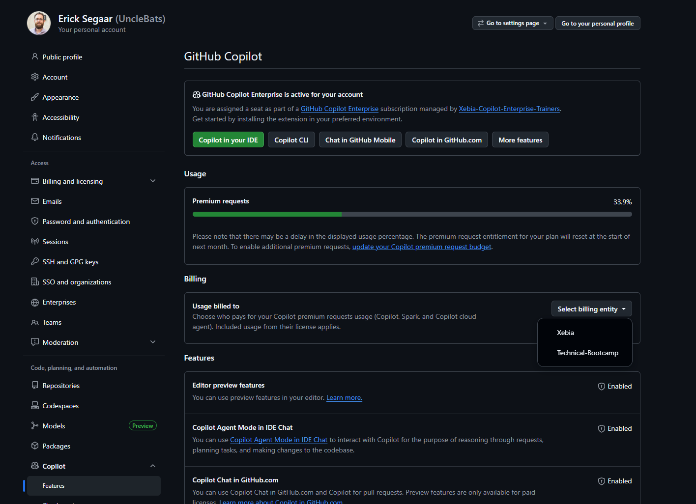
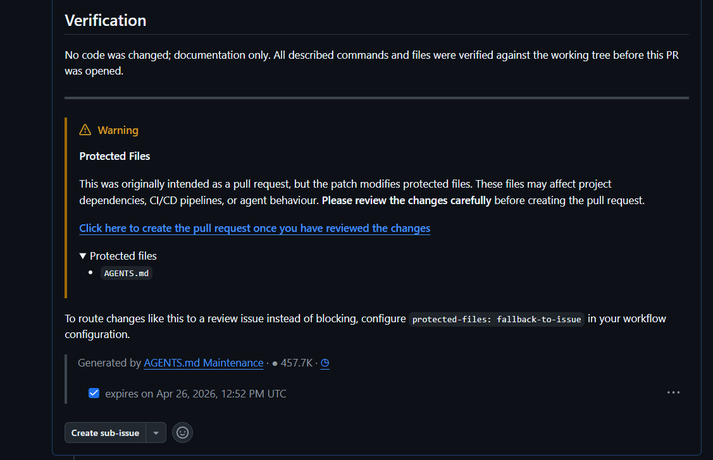

# GitHub Agentic Workflows Workshop - Participant Handout

## Quick Reference Guide

**Workshop:** From Code to Automation: Mastering GitHub Agentic Workflows  
**Duration:** 2 hours  
**Date:** [Your Event Date]

---

## 📋 Prerequisites

Before starting, ensure you have:

- [ ] GitHub account (sign up at github.com)
- [ ] GitHub Copilot access (start trial at github.com/copilot)
- [ ] Laptop with admin rights to install software
- [ ] Internet connection

---

## 🛠️ Setup Commands

### 1. Install GitHub CLI

**Windows:**

```powershell
winget install --id GitHub.cli
```

**Mac:**

```bash
brew install gh
```

**Linux (Debian/Ubuntu):**

```bash
# Install from GitHub CLI repository
sudo mkdir -p -m 755 /etc/apt/keyrings
wget -qO- https://cli.github.com/packages/githubcli-archive-keyring.gpg | sudo tee /etc/apt/keyrings/githubcli-archive-keyring.gpg > /dev/null
sudo chmod go+r /etc/apt/keyrings/githubcli-archive-keyring.gpg
echo "deb [arch=$(dpkg --print-architecture) signed-by=/etc/apt/keyrings/githubcli-archive-keyring.gpg] https://cli.github.com/packages stable main" | sudo tee /etc/apt/sources.list.d/github-cli.list > /dev/null
sudo apt update
sudo apt install gh -y

# For other distributions (Fedora, Arch, etc.):
# See: https://github.com/cli/cli/blob/trunk/docs/install_linux.md
```

**Verify:**

```bash
gh --version
# Should show version 2.87.3 or higher
```

### 2. Install Extensions

```bash
# Install gh-copilot (optional but recommended)
gh extension install github/gh-copilot

# Install gh-aw (required)
gh extension install github/gh-aw

# Verify installation
gh aw --version
# Should show version v0.68.1 or higher
```

### 3. Authenticate with GitHub

```bash
gh auth login

# Follow the prompts:
# ? Where do you use GitHub? → GitHub.com
# ? What is your preferred protocol for Git operations? → HTTPS
# ? Authenticate Git with your GitHub credentials? → Yes
# ? How would you like to authenticate GitHub CLI? → Login with a web browser

# Copy the one-time code (e.g., XXXX-XXXX)
# Press Enter to open https://github.com/login/device in your browser
# Paste the code in the browser and authorize

# Expected output:
# ✓ Authentication complete.
# ✓ Logged in as <your-github-username>
```

---

## 🎯 Repository Setup

### 1. Create Your Repository on GitHub

**Note:** If you're not signed in to github.com in your web browser, sign in first.

1. Go to github.com → Click **New** (top left, next to "Top Repositories")
   
   

2. **Choose owner:** Select your GitHub user account
3. **Name:** `copilot-adventures-[yourname]`
4. **Visibility:** Public or Private (your choice)
5. **Do NOT** add README, .gitignore, or license
6. Click "Create repository"

### 2. Configure Repository Settings

**Actions Permissions:**

- Settings → Actions → General
- ✅ Allow all actions and reusable workflows
- Workflow permissions: ✅ Read and write permissions
- ✅ Allow GitHub Actions to create and approve pull requests
- **Click "Save"** to apply changes

**Enable Features:**

- Settings → General → Features
- ✅ Issues
- ✅ Discussions
- **Note:** Feature changes are applied immediately (no save button needed)

### 3. Clone and Push CopilotAdventures

```bash
# Clone Microsoft's CopilotAdventures
git clone https://github.com/microsoft/CopilotAdventures.git
cd CopilotAdventures

# Remove original remote
git remote remove origin

# Add YOUR repository as remote (replace with your username/repo)
git remote add origin https://github.com/YOUR-USERNAME/copilot-adventures-YOURNAME.git

# Push to your repository
git push -u origin main
```

### 4. Create PAT (Personal Access Token)

1. Click on your **profile icon** (top-right) → **Settings** → **Developer settings** (bottom left of the new page)
2. **Personal access tokens** → **Fine-grained tokens**
3. Click "**Generate new token**"
4. **Token name:** `Agentic Workflows Copilot Token`
5. Leave the defaults:
   - **Resource owner:** Your GitHub user account
   - **Expiration:** 30 days
   - **Repository access:** Public Repositories (only)
6. **Permissions:** Scroll down and click "**Add permission**" → Select **"Copilot Requests"**
   - This allows the user of this token to make Copilot requests on your behalf, using your premium requests and calls
   
   

7. Click "**Generate token**" → **Copy it immediately** (you won't see it again)!

```bash
# Store token as a repository action secret (paste your actual token)
gh aw secrets set COPILOT_GITHUB_TOKEN --value "YOUR_TOKEN_HERE"
```

This command stores the PAT token as a **repository action secret** in your repository. GitHub Actions workflows will use this secret to authenticate Copilot requests on your behalf.

**Verify the secret was created:**

Go to `github.com/YOUR-USERNAME/copilot-adventures-YOURNAME/settings/secrets/actions` (replace with your actual username and repo name) and you should see **COPILOT_GITHUB_TOKEN** listed there.

**Create a Classic Token for CI Trigger:**

Some agentic workflows (like the CI Coach) use `safe-outputs` to create **pull requests** that immediately trigger your CI pipeline. For this to work, the PR needs to be created with a token that has `repo` and `workflow` permissions — the fine-grained Copilot token above doesn't have these scopes.

Without this classic token, workflows can still create issues, but PRs created by the agent won't automatically trigger CI runs. You'd have to manually close and reopen the PR to kick off CI.

1. Go to **Settings** → **Developer settings** → **Personal access tokens** → **Tokens (classic)**
2. Click "**Generate new token**" → Select **"Generate new token (classic)"**
3. **Note:** `gh-aw-application`
4. **Expiration:** 30 days
5. **Select scopes:**
   - ✅ **repo** (Full control of private repositories)
   - ✅ **workflow** (Update GitHub Action workflows)

   

6. Click "**Generate token**" → **Copy it immediately**!

```bash
# Store the classic token as a repository action secret
gh aw secrets set GH_AW_CI_TRIGGER_TOKEN --value "YOUR_COPIED_TOKEN"
```

**Verify both secrets exist:**

Go to `github.com/YOUR-USERNAME/copilot-adventures-YOURNAME/settings/secrets/actions` and you should now see both:
- **COPILOT_GITHUB_TOKEN** — For Copilot AI requests
- **GH_AW_CI_TRIGGER_TOKEN** — For creating PRs that trigger CI pipelines

### 5. Add a CI Pipeline

Before we start creating agentic workflows, let's add a basic CI pipeline that builds the projects. This pipeline will be used later by the CI Coach and CI Doctor workflows to analyze and optimize.

Create a file at `.github/workflows/ci.yml` with the following content:

```yaml
name: CI

on:
  push:
    branches: [ main ]
  pull_request:
    branches: [ main ]

jobs:
  build-csharp:
    runs-on: ubuntu-latest
    steps:
      - uses: actions/checkout@v4
      
      - name: Setup .NET
        uses: actions/setup-dotnet@v4
        with:
          dotnet-version: '8.0.x'
      
      - name: Build C# Solutions
        run: dotnet build Solutions/CSharp/CopilotAdventures.sln
  
  build-javascript:
    runs-on: ubuntu-latest
    steps:
      - uses: actions/checkout@v4
      
      - name: Setup Node.js
        uses: actions/setup-node@v4
        with:
          node-version: '20'
      
      - name: Validate JavaScript Files
        run: |
          for f in Solutions/JavaScript/*.js; do node --check "$f"; done
          echo "JavaScript syntax validation passed"
  
  build-python:
    runs-on: ubuntu-latest
    steps:
      - uses: actions/checkout@v4
      
      - name: Setup Python
        uses: actions/setup-python@v5
        with:
          python-version: '3.12'
      
      - name: Validate Python Files
        run: |
          python -m py_compile Solutions/Python/*.py
          echo "Python syntax validation passed"
```

Commit and push:

```bash
git add .github/workflows/ci.yml
git commit -m "Add CI build pipeline"
git push
```

This pipeline only builds and validates syntax — no tests yet. The CI Coach (Exercise 2) will later analyze this pipeline and suggest optimizations.

---

## 📝 Workshop Exercises

### Introduction: Why Agentic Workflows?

**The Challenge:**

Imagine a team of 9 people working on a repository. Everyone is busy with their tasks, and while you generally know what your team is working on, you're never fully in touch with everything that's been completed or what's coming next. You've added daily standups and progress boards, but challenges remain:

- What happens when people have a day off?
- What if someone forgets to mention critical progress during standup?
- Who notices that PR sitting open for 2 days without a review?
- How do you track the actual state of the repository between standups?

**The Solution:**

Instead of relying solely on humans to track and communicate everything, we'll create automated assistants that work continuously in the background. These agentic workflows will:

- Generate daily summaries of real repository activity
- Monitor PRs and issues that need attention
- Provide objective data for standups and planning
- Work 24/7 without taking days off
- Never forget to check or report on important changes

**What We're Building:**

Throughout these exercises, you'll progressively build an ecosystem of intelligent automations that transform your repository into a self-organizing, self-reporting system. Each workflow adds a new capability, and together they create comprehensive visibility into your project's health and progress.

**How We're Building:**

You'll experience three different approaches to creating workflows, each with increasing quality and sophistication:

1. **Interactive CLI** (`gh aw new`) - Quick and interactive, good for learning
2. **Cloud Agent** (web browser agent tab) - Better quality by referencing documentation
3. **Repository Agent** (VS Code Copilot Chat after `gh aw init`) - Best quality with repository context

Let's start with the most fundamental need: knowing what happened in your repository each day.

---

### Exercise 1: Daily Standup Status

**Goal:** Create a workflow that generates a daily summary of repository activity to support your standup meetings.

**Method:** We'll use the interactive CLI (`gh aw new`) to learn the fundamentals of workflow creation.

**Step 1: Create the workflow**

```bash
gh aw new
```

You'll be guided through several prompts:

**1. What should we call this workflow?**
```
daily-report
```

**2. When should this workflow run?**
- Choose: `Schedule (daily, scattered execution time)`

**3. Which AI engine should process this workflow?**
- Choose: `copilot - GitHub Copilot CLI`

**4. Which tools should the AI have access to?**
- Select:
  - `github` - GitHub API tools (issues, PRs, comments, repos)
- Tools enabled:
  - `create-issue` - Create a new GitHub issue
  - `add-comment` - Add a comment to an issue, PR, or discussion
  - `close-issue` - Close a GitHub issue
  - `update-issue` - Update an existing GitHub issue

**5. Network Access Control**
- Leave defaults (no external network access needed)

**6. What should this workflow do?** (Description)
```
Run daily at 9 AM and create an issue with a summary of repository activity from past 24 hours. Include commits, pull requests, issues, and CI/CD failures.
```

**Step 2: Review the generated files**

The command creates **four files**:

1. **`daily-report.md`** - The editable source workflow in `.github/workflows/`
2. **`daily-report.lock.yml`** - The compiled GitHub Actions workflow in `.github/workflows/`
3. **`.gitattributes`** - Git configuration file in the repository root
4. **`.github/aw/actions-lock.json`** - GitHub Actions version lock file

**Understanding the files:**

**`daily-report.md`** contains:
- **Frontmatter** (YAML between `---` markers): Configuration defining triggers, permissions, and tools
- **Natural language instructions**: Your description in markdown format

**`daily-report.lock.yml`** is the compiled workflow that:
- Contains a simplified version of your prompt
- Is what GitHub Actions actually executes
- Gets regenerated when you change the `.md` file

**`.gitattributes`** contains:
```
.github/workflows/*.lock.yml linguist-generated=true merge=ours
```
This configuration:
- Marks all `.lock.yml` files as generated (excluded from language statistics)
- Sets merge strategy to `ours` (automatically resolves merge conflicts by keeping your version)

**`.github/aw/actions-lock.json`** locks GitHub Actions to specific versions and commit SHAs:
```json
{
  "entries": {
    "actions/checkout@v6.0.2": {
      "repo": "actions/checkout",
      "version": "v6.0.2",
      "sha": "de0fac2e4500dabe0009e67214ff5f5447ce83dd"
    },
    ...
  }
}
```
This file is a cache of resolved `action@version` → commit SHA mappings. During workflow compilation, the compiler tries to pin each action reference to an immutable commit SHA for security. The cache avoids problems when compiling with limited-permission tokens (like GitHub Copilot Coding Agent) that may not have access to resolve external repositories. Without this cache, compilation can be unstable—succeeding with a permissive token but failing when token access is restricted. Commit this file to version control so all contributors use consistent action references.

📚 **Learn more:** [What is the actions-lock.json file?](https://github.github.com/gh-aw/reference/faq/#what-is-the-actions-lockjson-file)

📚 **Learn more:** [How Agentic Workflows Work](https://github.github.com/gh-aw/introduction/how-they-work/)

**Step 3: Observe the limitation**

Open `.github/workflows/daily-report.md` and look at the prompt. It's very basic - just your description. This works, but we can achieve much better results.

**Why this matters:** The quality of the AI's output depends heavily on the quality and detail of the instructions. The simple interactive CLI creates a minimal prompt, which means the workflow might:
- Miss important details
- Not format output consistently
- Lack error handling
- Be less reliable

**What's next:** In the following exercises, we'll use more sophisticated approaches that generate better prompts and higher-quality workflows.

**Step 4: Commit and test**

```bash
# Review the generated files or view in your code editor
cat .github/workflows/daily-report.md
cat .github/workflows/daily-report.lock.yml

# Commit all files
git add .
git commit -m "Add daily report workflow (basic version)"
git push
```

**Step 5: Manually trigger to test**

Since it's scheduled for daily execution, trigger it manually to see it work:

1. Go to your repository on GitHub
2. Click **Actions** tab
3. Select **daily-report** workflow
4. Click **Run workflow** button
5. Watch it execute


**Understanding the workflow execution:**

The workflow runs through **5 distinct phases**:

1. **activation** (✅ ~16s) - Sets up the workflow environment, checks out the repository code, and prepares the runtime
2. **agent** (✅ ~2m) - The AI agent analyzes your repository, reads commits, PRs, and issues from the past 24 hours, and formulates a summary
3. **detection** (🟡 ~45s) - Validates the agent's output to ensure it's properly formatted and safe to process
4. **safe_outputs** (⚪ pending) - **This is the automation step** that interprets the JSON output from the agent and creates the actual issue in your repository
5. **conclusion** (⚪ pending) - Finalizes the workflow and cleans up

**Important:** The agent itself doesn't directly create issues, PRs, or comments. Instead, it produces **structured JSON output** that describes what should be created. The `safe_outputs` step then interprets this JSON and performs the actual GitHub API calls to create the issue. This separation ensures security and allows for validation before any changes are made to your repository.

---

### Exercise 1b: Upgrade Daily Report with Cloud Agent

**Why: From Basic to Production-Quality**

In Exercise 1, you used the interactive CLI to create a daily-report workflow. It works, but the prompt is minimal—just your one-line description. The cloud agent produces significantly better workflows because it can **download and reference the official documentation** while generating the workflow. This means richer prompts, better error handling, and more consistent output formatting.

Think of it this way: the CLI is like writing a quick note from memory, while the cloud agent is like writing with the documentation open in front of you.

**What: A Smarter Daily Report**

By updating the existing workflow through the cloud agent, you'll get:
- **Detailed, structured prompts** generated from documentation best practices
- **Better formatting** for the daily summary issue
- **More comprehensive coverage** of repository activity
- **A Pull Request** with the changes, so you can compare before and after

**How: Update Using the Cloud Agent**

**Method:** We'll use the cloud agent (web browser) to upgrade the existing daily-report workflow.

**Step 1: Navigate to the cloud agent**

1. Go to your repository on GitHub.com in your web browser
2. Click on the **Agent** tab (next to Code, Issues, Pull Requests, etc.)

**⚠️ First-time setup — Configure billing for cloud resources:**

If this is your first time using the cloud agent, you may see a **red banner** instructing you to configure billing for cloud resources and premium requests. To resolve this:

1. Click the link in the banner, or navigate manually:
   - Click your **profile icon** (top-right) → **Settings**
   - In the left sidebar: **Copilot** → **Features**
2. Scroll down to the **Billing** section
3. Under **"Usage billed to"**, click **"Select billing entity"**
4. Select the **organization** where you receive your Copilot license from



Once configured, return to your repository and click the **Agent** tab again.

**Step 2: Provide the upgrade prompt**

In the cloud agent chat, provide this prompt:

```
Update the existing daily-report workflow for GitHub Agentic Workflows using https://raw.githubusercontent.com/github/gh-aw/main/create.md. Create a Pull Request when you're done.

The purpose of the workflow is to act as a daily report that helps team members keep up to date. It should:
Run daily at 9 AM and create an issue with a summary of repository activity from past 24 hours. Include commits, pull requests, issues, and CI/CD failures.

Use the schedule trigger and create issues using safe-outputs.
```

**Step 3: Review and merge the generated PR**

The cloud agent creates a **Pull Request** with the updated workflow files.

1. Go to your repository on GitHub → **Pull Requests** tab
2. Review the PR created by the agent
3. **Compare the changes:** Look at how the cloud agent improved the prompt in `.github/workflows/daily-report.md` compared to the basic version from Exercise 1
4. Verify the workflow files:
   - `.github/workflows/daily-report.md` (updated source workflow)
   - `.github/workflows/daily-report.lock.yml` (recompiled workflow)
5. **Merge the PR to main**

**Step 4: Pull the changes locally**

```bash
git pull
```

**Step 5: Compare the improvement**

Open `.github/workflows/daily-report.md` and notice how much richer the prompt is now. The cloud agent typically adds:
- Structured output formatting instructions
- Specific sections for commits, PRs, issues, and failures
- Error handling guidance
- Tone and style direction

**Step 6: Trigger the upgraded workflow**

Now let's run the improved version and compare the output:

1. Go to your repository → **Actions** tab
2. Select **daily-report** workflow
3. Click **Run workflow** button → Run workflow
4. Watch it execute through the same 5 phases (activation → agent → detection → safe_outputs → conclusion)

The resulting issue should contain roughly the same information as before, but now the output is **better structured and formatted**. The cloud agent's richer prompt gives the AI clearer instructions on how to organize commits, PRs, issues, and failures—so the generated issue is more consistent and easier to read during standups.

**Key Insight:** The same workflow purpose, but dramatically better instructions. This is why we use the cloud agent for all subsequent exercises—it consistently produces higher-quality workflows by referencing the official documentation during generation.

---

### Exercise 2: CI Coach

**Why: Building the Backbone of Your DevOps Practice**

Now that you have visibility into daily activity, let's focus on the backbone of your validation system: your **Continuous Integration (CI) pipeline**.

Your CI pipeline is critical because it:
- **Triggers on each change** - Every commit, every PR gets validated
- **Validates each update** - Runs tests, checks code quality, enforces standards
- **Deploys to customers** - When successful, it puts your work in users' hands

As a team improving your DevOps practices, you need guardrails before letting AI run fully agentic. A healthy CI pipeline is non-negotiable because you want it to be:
- **Quick enough** - Fast feedback means you can wait for results and fix issues immediately
- **Consistent enough** - It's your single source of truth for "is this ready?"
- **Complete enough** - Tests all scenarios so you ship with confidence

**The challenge:** Teams often set up CI once and then the codebase evolves without the pipeline keeping pace. New dependencies get added, test patterns change, edge cases emerge - but the CI configuration stays static. You need constant validation that your pipeline is keeping up with your code.

**What: A CI Coach That Has Your Back**

The CI Coach workflow provides:
- **Proactive guidance** - Catches issues before CI runs, saving time
- **Evolutionary awareness** - Notices when your codebase has evolved beyond your current CI setup
- **Continuous nudges** - Suggests improvements as patterns emerge
- **Early warnings** - Spots potential failures before they happen

Instead of waiting for CI to fail and then reacting, you get coaching on every PR that helps you maintain a world-class pipeline.

**How: Create Your CI Coach Manually**

**Method:** This time we'll create the workflow file manually. This teaches you the anatomy of an agentic workflow—the frontmatter configuration and the natural language prompt—so you understand exactly what the CLI and cloud agent generate for you.

**Step 1: Initialize Agentic Workflows**

In Exercise 1, you created a workflow using `gh aw new`, which handled everything for you — including initialization. But now that we're creating a workflow manually, we first need to initialize the agentic workflows tooling in the repository. This sets up the `copilot-setup-steps.yml` file that configures the MCP server powering the AI agent during workflow execution.

Without this initialization, the compiled workflow won't have the infrastructure it needs to run the agent and process `safe-outputs` (like creating pull requests).

```bash
gh aw init
```

This creates the `.github/aw/` directory with configuration files. You can review what was created:

```bash
ls -la .github/aw/
```

**Step 2: Create a branch**

```bash
git pull
git checkout -b add-ci-coach
```

**Step 3: Create the workflow file**

Create a new file at `.github/workflows/ci-coach.md` and paste the following content:


````markdown
---
description: Daily CI optimization coach that analyzes GitHub Actions workflows for efficiency improvements and cost reduction opportunities

on:
  schedule:
    - cron: daily
  workflow_dispatch:

network:
  allowed:
  - defaults
  - dotnet
  - node
  - python
  - rust
  - java

permissions: read-all

tracker-id: ci-coach-daily

tools:
  github:
    toolsets: [default]
    min-integrity: none
  bash: true
  web-fetch:

safe-outputs:
  create-pull-request:
    expires: 2d
    title-prefix: "[ci-coach] "
    allowed-files:
      - .github/workflows/ci.yml
    protected-files: allowed
    github-token: ${{ secrets.GH_AW_CI_TRIGGER_TOKEN }}
    github-token-for-extra-empty-commit: ${{ secrets.GH_AW_CI_TRIGGER_TOKEN }}
timeout-minutes: 30
engine: copilot
---

# CI Optimization Coach

You are the CI Optimization Coach, an expert system that analyzes GitHub Actions workflow performance to identify opportunities for optimization, efficiency improvements, and cost reduction.

## Mission

Analyze CI workflows daily to identify concrete optimization opportunities that can make the test suite more efficient while minimizing costs and runtime.

## Current Context

- **Repository**: ${{ github.repository }}
- **Run Number**: #${{ github.run_number }}

## Analysis Framework

### Phase 1: Discovery (5 minutes)

Identify all GitHub Actions workflows in the repository:

1. **Find workflow files**: List all `.github/workflows/*.yml` and `.github/workflows/*.yaml` files
2. **Identify CI workflows**: Focus on workflows that run tests, builds, or lints
3. **Gather recent runs**: Use GitHub API to fetch the last 50-100 runs for each workflow
4. **Collect metrics**:
   - Average runtime per workflow
   - Success/failure rates
   - Job-level timing data
   - Cache usage patterns
   - Artifact sizes

### Phase 2: Analysis (10 minutes)

Analyze the collected data for optimization opportunities:

1. **Job Parallelization**
   - Are independent jobs running sequentially?
   - Can the critical path be reduced?
   - Are matrix jobs balanced?

2. **Cache Optimization**
   - Are dependencies cached effectively?
   - What's the cache hit rate?
   - Are cache keys optimal?

3. **Test Suite Structure**
   - Is test execution balanced?
   - Are slow tests identified?
   - Can tests run in parallel?

4. **Resource Sizing**
   - Are job timeouts appropriate?
   - Are runner types optimal?
   - Are jobs failing due to timeouts?

5. **Artifact Management**
   - Are artifacts necessary?
   - Are retention periods appropriate?
   - Can artifact sizes be reduced?

6. **Conditional Execution**
   - Can some jobs skip on certain conditions?
   - Are path filters used effectively?
   - Can workflow dispatch reduce unnecessary runs?

### Phase 3: Prioritization (5 minutes)

For each potential optimization, assess:

- **Impact**: How much time/cost savings? (High/Medium/Low)
- **Risk**: What's the risk of breaking something? (Low/Medium/High)
- **Effort**: How hard is it to implement? (Low/Medium/High)

Focus on **high impact + low risk + low-to-medium effort** optimizations.

### Phase 4: Implementation (8 minutes)

If you identify valuable improvements:

1. **Make focused changes** to workflow files:
   - Use the `edit` tool for precise modifications
   - Add inline comments explaining the optimization
   - Keep changes minimal and surgical

2. **Document the changes** thoroughly in the PR description

3. **Create a pull request** with clear rationale

### Phase 5: No Changes Path (2 minutes)

If no significant improvements are found:

1. Note the analysis results
2. Use the `noop` safe output tool to report "CI workflows analyzed - no optimization opportunities found"
3. Exit gracefully

## Optimization Patterns

### Common High-Value Optimizations

1. **Parallel Job Execution**
   ```yaml
   # Before: Sequential
   test:
     needs: [build]
   lint:
     needs: [build]
   
   # After: Parallel
   test:
     needs: [build]
   lint:
     needs: [build]  # Both run in parallel after build
   ```

2. **Matrix Balancing**
   ```yaml
   # Balance test distribution across matrix jobs
   matrix:
     group: [1, 2, 3, 4]  # Evenly distributed
   ```

3. **Path Filtering**
   ```yaml
   on:
     push:
       paths:
         - 'src/**'
         - 'tests/**'
   ```

### Anti-Patterns to Avoid

❌ **NEVER modify test code to hide failures**
- Don't add `|| true` to failing tests
- Don't suppress error output
- Don't skip failing tests without justification

❌ **Don't over-optimize**
- Avoid changes that save <2% of runtime
- Don't sacrifice clarity for minor gains
- Don't add complexity without clear benefit

## Pull Request Template

When creating a PR, use this structure:

````markdown
### Summary

[Brief description of optimization and expected benefit]

### Optimizations

#### 1. [Optimization Name]

**Type**: [Parallelization/Cache/Testing/Resource/Artifact/Conditional]
**Impact**: Estimated [X minutes/Y%] savings per run
**Risk**: Low/Medium/High

**Changes**:
- [Description of specific changes made]

**Rationale**: [Why this improves efficiency]

<details>
<summary><b>Detailed Analysis</b></summary>

[Metrics, before/after comparisons, supporting data]

</details>

### Expected Impact

- **Time Savings**: ~X minutes per run
- **Cost Reduction**: ~$Y per month (estimated based on 50 runs/month)
- **Risk Level**: Low/Medium/High

### Testing Recommendations

- [ ] Review workflow syntax
- [ ] Test on a feature branch first
- [ ] Monitor first few runs after merge
- [ ] Compare runtime before/after

## Quality Standards

- **Evidence-based**: All recommendations based on actual data
- **Minimal changes**: Surgical improvements, not rewrites
- **Low risk**: Prioritize safe optimizations
- **Measurable**: Include metrics to verify improvements
- **Reversible**: Changes should be easy to roll back

## Success Criteria

✅ Analyzed all GitHub Actions workflows
✅ Collected metrics from recent runs
✅ Identified optimization opportunities OR confirmed workflows are well-optimized
✅ If changes proposed: Created PR with clear rationale and expected impact
✅ If no changes: Used noop tool to report analysis complete
✅ Completed analysis in under 30 minutes

Begin your analysis now. Identify CI workflows, analyze their performance, and either propose optimizations through a pull request or report that no improvements are needed.
````


**Understanding the workflow structure:**

Take a moment to study what you just pasted. The file has two parts:

1. **Frontmatter** (between the `---` markers) — This is the configuration that tells GitHub Actions *how* to run the workflow:
   - `on:` — Triggers: runs daily on a schedule and can be triggered manually via `workflow_dispatch`
   - `permissions: read-all` — The agent can read everything but can only write through `safe-outputs`
   - `tools:` — What the agent can use: GitHub API, bash, and web-fetch
   - `safe-outputs:` — The agent's output creates a pull request (not direct changes), with a `[ci-coach]` title prefix
   - `engine: copilot` — Uses GitHub Copilot as the AI engine

2. **Natural language prompt** (after the second `---`) — This is what the AI agent actually reads and follows. Notice how detailed and structured it is compared to the basic prompt from Exercise 1. The 5-phase framework, optimization patterns, anti-patterns, and PR template all guide the agent toward consistent, high-quality results.

**Step 4: Compile the workflow**

```bash
gh aw compile ci-coach
```

This generates `.github/workflows/ci-coach.lock.yml` — the compiled GitHub Actions workflow that will actually execute.

**Step 5: Commit and push**

```bash
git add .
git commit -m "Add CI Coach optimization workflow"
git push -u origin add-ci-coach
```

**Step 6: Create a PR and merge**

```bash
gh pr create --title "Add CI Coach workflow" --body "Daily CI optimization coach that analyzes workflows for efficiency improvements and cost reduction opportunities"
```

1. Go to your repository on GitHub → **Pull Requests** tab
2. Review the PR to verify the workflow files look correct:
   - `.github/workflows/ci-coach.md` (the source workflow you created)
   - `.github/workflows/ci-coach.lock.yml` (the compiled workflow)
3. **Approve and merge the PR to main**

**Step 7: Pull main and trigger the workflow**

```bash
git checkout main
git pull
```

1. Go to your repository → **Actions** tab
2. Select **ci-coach** workflow
3. Click **Run workflow** button → Run workflow
4. Watch it execute through the 5 phases (activation → agent → detection → safe_outputs → conclusion)

**Step 8: Check the outcome**

After the workflow completes, check your repository for a new **Pull Request** with the `[ci-coach]` prefix. The CI Coach will have:
- Analyzed your existing GitHub Actions workflows
- Identified optimization opportunities (if any)
- Created a PR with proposed changes and detailed rationale

If no optimizations were found, the workflow exits gracefully via the `noop` path — which is a perfectly valid outcome for a well-configured repository.

**Step 9: Iterate until tests are added to CI**

The CI Coach is designed to suggest improvements incrementally. On the first run it might propose caching, parallelization, or other optimizations — but it may not immediately suggest adding tests. You need tests in your CI pipeline for Exercise 3 (CI Doctor), so keep iterating:

1. **Review and merge** the PR the CI Coach created (if any)
2. **Re-trigger** the ci-coach workflow: Actions → ci-coach → Run workflow
3. **Check the new PR** — does it add test steps (e.g., `npm test`, `dotnet test`, `pytest`) to `ci.yml`?
4. **If not yet:** merge the PR, and re-trigger again. Each run builds on the previous improvements.
5. **Repeat** until the CI Coach proposes adding tests to one or more build jobs.

Once you get a PR that adds test execution to the CI pipeline, **approve and merge it**. After merging, pull the changes:

```bash
git checkout main
git pull
```

Verify that `.github/workflows/ci.yml` now contains test commands by opening the file and checking the job steps.

**Why this matters for Exercise 3:** The CI Doctor diagnoses *failing* CI checks. If your pipeline only builds but never runs tests, there's nothing meaningful for the CI Doctor to diagnose. By letting the CI Coach evolve your pipeline to include tests, you create the conditions where the CI Doctor can demonstrate its value — analyzing test failures, identifying root causes, and posting actionable fixes.

**Key Insight:** By creating this workflow manually, you now understand exactly what the CLI and cloud agent generate behind the scenes. Every agentic workflow is just a markdown file with frontmatter configuration + a natural language prompt. The quality of the prompt directly determines the quality of the agent's output — which is why the detailed 5-phase framework produces better results than a one-line description.

This continuous feedback strengthens your guardrails as you prepare for more autonomous workflows.

---

### Exercise 3: CI Doctor

**Why: Eliminating Context Switches and Constant Monitoring**

Think about your team's current workflow when something breaks in CI:
- Someone gets a notification (often at an inconvenient time)
- They stop their current work to investigate
- They dig through logs to find the root cause
- They search for similar issues or fixes
- They create a fix and submit it

**The challenge:** This constant context switching is expensive. Every time someone stops feature work to fix a CI failure, you lose momentum, focus, and productivity. Your team can't scale if everyone needs to be on alert for CI failures.

**What: An Automated CI Diagnostician**

Instead of your team monitoring workflows and context switching when things break, the CI Doctor workflow:
- **Activates on-demand** when you add the `ci-doctor` label to a PR with failing checks
- **Analyzes failure logs** to identify root causes
- **Searches repository history** for similar issues and past solutions
- **Posts a diagnostic comment** on the PR with actionable fixes
- **Creates tracking issues** for CI failures that need attention

This shifts your team from **reactive firefighting** to **proactive pipeline maintenance**. The CI Doctor handles the diagnosis and posts the fix — you just review and act.

**How: Create Your CI Doctor Manually**

**Method:** Just like Exercise 2, we'll create the workflow file manually. The infrastructure from `gh aw init` (Exercise 2) is already in place, so we only need the workflow file itself.

**Step 1: Create a branch**

```bash
git checkout main
git pull
git checkout -b add-ci-doctor
```

**Step 2: Create the workflow file**

Create a new file at `.github/workflows/ci-doctor.md` and paste the following content:


````markdown
---
description: Investigates failed CI workflows to identify root causes and patterns, creating issues with diagnostic information; also reviews PR check failures when the ci-doctor label is applied
on:
  label_command:
    name: ci-doctor
    events: [pull_request]

permissions:
  actions: read         # To query workflow runs, jobs, and logs
  contents: read        # To read repository files
  issues: read          # To search and analyze issues (label removal handled by activation job)
  pull-requests: read   # To read PR context (comments posted via safe-outputs)
  checks: read          # To read check run results

network: defaults

engine: copilot

safe-outputs:
  create-issue:
    expires: 1d
    title-prefix: "[CI Failure Doctor] "
    labels: [cookie]
    close-older-issues: true
  add-comment:
    max: 1
    hide-older-comments: true
  update-issue:
  noop:
  messages:
    footer: "> 🩺 *Diagnosis provided by [{workflow_name}]({run_url})*{effective_tokens_suffix}{history_link}"
    run-started: "🏥 CI Doctor reporting for duty! [{workflow_name}]({run_url}) is examining the patient on this {event_type}..."
    run-success: "🩺 Examination complete! [{workflow_name}]({run_url}) has delivered the diagnosis. Prescription issued! 💊"
    run-failure: "🏥 Medical emergency! [{workflow_name}]({run_url}) {status}. Doctor needs assistance..."

tools:
  cache-memory: true
  web-fetch:
  github:
    toolsets: [default, actions]  # default: context, repos, issues, pull_requests; actions: workflow logs and artifacts

timeout-minutes: 20

steps:
  - name: Download CI failure logs and artifacts
    if: github.event_name == 'workflow_run'
    env:
      GH_TOKEN: ${{ secrets.GITHUB_TOKEN }}
      RUN_ID: ${{ github.event.workflow_run.id }}
      REPO: ${{ github.repository }}
    run: |
      set -e
      LOG_DIR="/tmp/ci-doctor/logs"
      ARTIFACT_DIR="/tmp/ci-doctor/artifacts"
      FILTERED_DIR="/tmp/ci-doctor/filtered"
      mkdir -p "$LOG_DIR" "$ARTIFACT_DIR" "$FILTERED_DIR"

      echo "=== CI Doctor: Pre-downloading logs and artifacts for run $RUN_ID ==="

      # Get failed jobs and their failed steps
      gh api "repos/$REPO/actions/runs/$RUN_ID/jobs" \
        --jq '[.jobs[] | select(.conclusion == "failed" or .conclusion == "cancelled") | {id:.id, name:.name, failed_steps:[.steps[]? | select(.conclusion=="failed") | .name]}]' \
        > "$LOG_DIR/failed-jobs.json"

      FAILED_COUNT=$(jq 'length' "$LOG_DIR/failed-jobs.json")
      echo "Found $FAILED_COUNT failed job(s)"

      if [ "$FAILED_COUNT" -eq 0 ]; then
        echo "No failed jobs found, skipping log download"
        exit 0
      fi

      echo "Failed jobs:"
      cat "$LOG_DIR/failed-jobs.json"

      # Download logs for each failed job and apply generic error heuristics
      jq -r '.[].id' "$LOG_DIR/failed-jobs.json" | while read -r JOB_ID; do
        LOG_FILE="$LOG_DIR/job-${JOB_ID}.log"
        echo "Downloading log for job $JOB_ID..."
        gh api "repos/$REPO/actions/jobs/$JOB_ID/logs" > "$LOG_FILE" 2>/dev/null \
          || echo "(log download failed)" > "$LOG_FILE"
        echo "  -> Saved $(wc -l < "$LOG_FILE") lines to $LOG_FILE"

        # Apply generic heuristics: find lines with common error indicators
        HINTS_FILE="$FILTERED_DIR/job-${JOB_ID}-hints.txt"
        grep -n -iE "(error[: ]|ERROR|FAIL|panic:|fatal[: ]|undefined[: ]|exception|exit status [^0])" \
          "$LOG_FILE" | head -30 > "$HINTS_FILE" 2>/dev/null || true

        if [ -s "$HINTS_FILE" ]; then
          echo "  -> Pre-located $(wc -l < "$HINTS_FILE") hint line(s) in $HINTS_FILE"
        else
          echo "  -> No error hints found in $LOG_FILE"
        fi
      done

      # Download and unpack all artifacts from the failed run
      echo ""
      echo "=== Downloading artifacts for run $RUN_ID ==="
      gh run download "$RUN_ID" --repo "$REPO" --dir "$ARTIFACT_DIR" 2>/dev/null \
        || echo "No artifacts available or download failed"

      # Apply heuristics to artifact text files
      find "$ARTIFACT_DIR" -type f \( \
        -name "*.txt" -o -name "*.log" -o -name "*.json" \
        -o -name "*.xml" -o -name "*.out" -o -name "*.err" \
      \) | while read -r ARTIFACT_FILE; do
        REL_PATH="${ARTIFACT_FILE#"$ARTIFACT_DIR"/}"
        SAFE_NAME=$(echo "$REL_PATH" | tr '/' '_')
        HINTS_FILE="$FILTERED_DIR/artifact-${SAFE_NAME}-hints.txt"
        grep -n -iE "(error[: ]|ERROR|FAIL|panic:|fatal[: ]|undefined[: ]|exception|exit status [^0])" \
          "$ARTIFACT_FILE" | head -30 > "$HINTS_FILE" 2>/dev/null || true
        if [ -s "$HINTS_FILE" ]; then
          echo "  -> Artifact hints: $HINTS_FILE ($(wc -l < "$HINTS_FILE") lines from $ARTIFACT_FILE)"
        fi
      done

      # Write summary for the agent
      SUMMARY_FILE="/tmp/ci-doctor/summary.txt"
      {
        echo "=== CI Doctor Pre-Analysis ==="
        echo "Run ID: $RUN_ID"
        echo ""
        echo "Failed jobs (details in $LOG_DIR/failed-jobs.json):"
        jq -r '.[] | "  Job \(.id): \(.name)\n    Failed steps: \(.failed_steps | join(", "))"' \
          "$LOG_DIR/failed-jobs.json"
        echo ""
        echo "Downloaded log files ($LOG_DIR):"
        for LOG_FILE in "$LOG_DIR"/job-*.log; do
          [ -f "$LOG_FILE" ] || continue
          echo "  $LOG_FILE ($(wc -l < "$LOG_FILE") lines)"
        done
        echo ""
        echo "Downloaded artifact files ($ARTIFACT_DIR):"
        find "$ARTIFACT_DIR" -type f | while read -r f; do
          echo "  $f"
        done
        echo ""
        echo "Filtered hint files ($FILTERED_DIR):"
        for HINTS_FILE in "$FILTERED_DIR"/*-hints.txt; do
          [ -s "$HINTS_FILE" ] || continue
          echo "  $HINTS_FILE ($(wc -l < "$HINTS_FILE") matches)"
          head -3 "$HINTS_FILE" | sed 's/^/    /'
        done
      } | tee "$SUMMARY_FILE"

      echo ""
      echo "✅ Pre-analysis complete. Agent should start with $SUMMARY_FILE"

  - name: Fetch PR check run status
    if: github.event_name == 'pull_request'
    env:
      GH_TOKEN: ${{ secrets.GITHUB_TOKEN }}
      PR_NUMBER: ${{ github.event.pull_request.number }}
      HEAD_SHA: ${{ github.event.pull_request.head.sha }}
      REPO: ${{ github.repository }}
    run: |
      set -e
      PR_DIR="/tmp/ci-doctor/pr"
      mkdir -p "$PR_DIR"

      echo "=== CI Doctor: Fetching check runs for PR #$PR_NUMBER (SHA: $HEAD_SHA) ==="

      # Fetch all check runs for the PR head commit (paginated to handle >30 jobs)
      gh api --paginate "repos/$REPO/commits/$HEAD_SHA/check-runs" \
        --jq '.check_runs[] | {id:.id, name:.name, status:.status, conclusion:.conclusion, html_url:.html_url}' \
        | jq -s '.' \
        > "$PR_DIR/check-runs.json"

      TOTAL=$(jq 'length' "$PR_DIR/check-runs.json")
      FAILED=$(jq '[.[] | select(.conclusion == "failure" or .conclusion == "cancelled" or .conclusion == "timed_out")] | length' "$PR_DIR/check-runs.json")
      echo "Found $TOTAL check run(s), $FAILED failing"

      # Isolate the failing check runs
      jq '[.[] | select(.conclusion == "failure" or .conclusion == "cancelled" or .conclusion == "timed_out")]' \
        "$PR_DIR/check-runs.json" > "$PR_DIR/failed-checks.json"

      # Write a human-readable summary
      SUMMARY_FILE="$PR_DIR/summary.txt"
      {
        echo "=== CI Doctor PR Pre-Analysis ==="
        echo "PR: #$PR_NUMBER"
        echo "HEAD SHA: $HEAD_SHA"
        echo "Total check runs: $TOTAL"
        echo "Failing check runs: $FAILED"
        echo ""
        echo "All checks ($PR_DIR/check-runs.json):"
        jq -r '.[] | "  \(.conclusion // .status): \(.name)"' "$PR_DIR/check-runs.json"
        echo ""
        if [ "$FAILED" -gt 0 ]; then
          echo "Failing checks ($PR_DIR/failed-checks.json):"
          jq -r '.[] | "  - \(.name) [\(.conclusion)]: \(.html_url)"' "$PR_DIR/failed-checks.json"
        fi
      } | tee "$SUMMARY_FILE"

      echo ""
      echo "✅ PR pre-analysis complete. Agent should start with $SUMMARY_FILE"

source: githubnext/agentics/workflows/ci-doctor.md@ea350161ad5dcc9624cf510f134c6a9e39a6f94d
---
# CI Failure Doctor

You are the CI Failure Doctor, an expert investigative agent that analyzes failed GitHub Actions checks to identify root causes and patterns. You operate in one of two modes depending on the trigger:

- **PR Check Review Mode** — triggered when someone applies the `ci-doctor` label to a pull request; reviews the PR's failing CI checks and posts a diagnostic comment.
- **CI Failure Investigation Mode** — triggered when the CI workflow completes with a failure; performs a deep investigation and creates a tracking issue.

---

{{#if github.event.pull_request.number}}
## PR Check Review Mode

You were invoked via the `ci-doctor` label on pull request #${{ github.event.pull_request.number }}.

### PR Context

- **Repository**: ${{ github.repository }}
- **Pull Request**: #${{ github.event.pull_request.number }}
- **Triggered by**: ${{ github.actor }}
- **Head SHA**: `${{ github.event.pull_request.head.sha }}`
- **Base SHA**: `${{ github.event.pull_request.base.sha }}`

### Pre-Fetched Data

Check run data was fetched before this session:

- **Summary**: `/tmp/ci-doctor/pr/summary.txt` — all check runs and their status
- **All checks**: `/tmp/ci-doctor/pr/check-runs.json` — full check run details
- **Failed checks**: `/tmp/ci-doctor/pr/failed-checks.json` — checks with failure/cancelled/timed_out conclusions

### PR CI Doctor Protocol

> **Available GitHub tools**: `list_workflow_jobs`, `get_check_runs`, `get_job_logs`, and other actions tools are provided via the configured GitHub toolsets (`default` + `actions`).

1. **Read** `/tmp/ci-doctor/pr/summary.txt` to understand the current check status.
2. **If no checks are failing**: call `noop` with the message "All PR checks are passing — no action needed." and stop.
3. **For each failing check**:
   a. Use `list_workflow_jobs` (or `get_check_runs`) to get the associated workflow run and job IDs.
   b. Use `get_job_logs` with `return_content=true` and `tail_lines=150` to retrieve the relevant log section.
   c. Identify the root cause: compile error, test failure, lint issue, config problem, flaky test, etc.
4. **Diagnose and suggest fixes**: provide specific, actionable recommendations with file paths and line numbers where possible.
5. **Post a comment** on the PR using `add_comment` with your full diagnosis. Structure it as shown below.

### PR Diagnostic Comment Format

```markdown
### 🩺 CI Doctor Diagnosis

**Checked** ${{ github.event.pull_request.head.sha }}

#### Summary
<!-- Brief overview of what was found -->

#### Failing Checks

| Check | Conclusion | Root Cause |
|-------|-----------|------------|
<!-- one row per failing check -->

<details>
<summary>Detailed Analysis</summary>

<!-- Per-check deep-dive with log excerpts and root cause explanation -->

</details>

#### Recommended Fixes
- [ ] <!-- Specific actionable fix per issue -->

#### Prevention Tips
<!-- How to avoid similar failures in future PRs -->

<details>
<summary>Analysis Steps</summary>

<!-- Summary of the steps taken to analyze the failing checks (tools called, logs read, patterns found) -->

</details>
```

**IMPORTANT**: You **MUST** always end by calling `add_comment` (to post your diagnosis on the PR) or `noop` (if all checks are passing). Never finish without calling one of these.

**IMPORTANT**: Your comment **MUST** always include an **Analysis Steps** section (using `<details><summary>Analysis Steps</summary>`) that summarizes what you did to reach your conclusions — which tools you called, which logs you read, and what patterns you found. This gives readers progressive disclosure: a quick summary up front, with the full investigation trail available on demand.

{{/if}}
{{#if github.event.workflow_run.id}}
## CI Failure Investigation Mode

## Current Context

- **Repository**: ${{ github.repository }}
- **Workflow Run**: ${{ github.event.workflow_run.id }}
- **Conclusion**: ${{ github.event.workflow_run.conclusion }}
- **Run URL**: ${{ github.event.workflow_run.html_url }}
- **Head SHA**: ${{ github.event.workflow_run.head_sha }}

## Pre-Analysis Data

Logs and artifacts have been pre-downloaded before this session started:

- **Summary**: `/tmp/ci-doctor/summary.txt` — failed jobs, failed steps, all file locations, and pre-located error hints
- **Job metadata**: `/tmp/ci-doctor/logs/failed-jobs.json` — structured list of failed jobs and their failed steps
- **Log files**: `/tmp/ci-doctor/logs/job-<job-id>.log` — full job logs downloaded from GitHub Actions
- **Artifact files**: `/tmp/ci-doctor/artifacts/` — all workflow run artifacts, unpacked by artifact name
- **Hint files**: `/tmp/ci-doctor/filtered/*-hints.txt` — pre-located error lines (from logs and artifacts) via generic grep heuristics

**Start here**: Read `/tmp/ci-doctor/summary.txt` first — it lists every file location and the first few hint matches. Then examine the relevant hint files to jump directly to error locations (read ±10 lines around each hinted line number before loading the full log or artifact).

## Investigation Protocol

**ONLY proceed if the workflow conclusion is 'failure' or 'cancelled'**. If the workflow was successful, **call the `noop` tool** immediately and exit.

### Phase 1: Initial Triage
1. **Verify Failure**: Check that `${{ github.event.workflow_run.conclusion }}` is `failure` or `cancelled`
   - **If the workflow was successful**: Call the `noop` tool with message "CI workflow completed successfully - no investigation needed" and **stop immediately**. Do not proceed with any further analysis.
   - **If the workflow failed or was cancelled**: Proceed with the investigation steps below.
2. **Get Workflow Details**: Use `get_workflow_run` to get full details of the failed run
3. **List Jobs**: Use `list_workflow_jobs` to identify which specific jobs failed
4. **Quick Assessment**: Determine if this is a new type of failure or a recurring pattern

### Phase 2: Deep Log Analysis
1. **Use Pre-Downloaded Logs and Artifacts**: Use the files in `/tmp/ci-doctor/`:
   - Read the summary and hint files first (minimal context load)
   - Read ±10 lines around each hinted line number in the full log or artifact file
   - Check `/tmp/ci-doctor/artifacts/` for any structured output (test reports, coverage, etc.)
   - Only load the full log content if the hints are insufficient
2. **Fallback Log Retrieval**: If pre-downloaded files are unavailable, use `get_job_logs` with `failed_only=true`, `return_content=true`, and `tail_lines=100` to get the most relevant portion of logs directly (avoids downloading large blob files). Do NOT use `web-fetch` on blob storage log URLs.
3. **Pattern Recognition**: Analyze logs for:
   - Error messages and stack traces
   - Dependency installation failures
   - Test failures with specific patterns
   - Infrastructure or runner issues
   - Timeout patterns
   - Memory or resource constraints
4. **Extract Key Information**:
   - Primary error messages
   - File paths and line numbers where failures occurred
   - Test names that failed
   - Dependency versions involved
   - Timing patterns

### Phase 3: Historical Context Analysis
1. **Search Investigation History**: Use file-based storage to search for similar failures:
   - Read from cached investigation files in `/tmp/memory/investigations/`
   - Parse previous failure patterns and solutions
   - Look for recurring error signatures
2. **Issue History**: Search existing issues for related problems
3. **Commit Analysis**: Examine the commit that triggered the failure
4. **PR Context**: If triggered by a PR, analyze the changed files

### Phase 4: Root Cause Investigation
1. **Categorize Failure Type**:
   - **Code Issues**: Syntax errors, logic bugs, test failures
   - **Infrastructure**: Runner issues, network problems, resource constraints
   - **Dependencies**: Version conflicts, missing packages, outdated libraries
   - **Configuration**: Workflow configuration, environment variables
   - **Flaky Tests**: Intermittent failures, timing issues
   - **External Services**: Third-party API failures, downstream dependencies

2. **Deep Dive Analysis**:
   - For test failures: Identify specific test methods and assertions
   - For build failures: Analyze compilation errors and missing dependencies
   - For infrastructure issues: Check runner logs and resource usage
   - For timeout issues: Identify slow operations and bottlenecks

### Phase 5: Pattern Storage and Knowledge Building
1. **Store Investigation**: Save structured investigation data to files:
   - Write investigation report to `/tmp/memory/investigations/<timestamp>-<run-id>.json`
     - **Important**: Use filesystem-safe timestamp format `YYYY-MM-DD-HH-MM-SS-sss` (e.g., `2026-02-12-11-20-45-458`)
     - **Do NOT use** ISO 8601 format with colons (e.g., `2026-02-12T11:20:45.458Z`) - colons are not allowed in artifact filenames
   - Store error patterns in `/tmp/memory/patterns/`
   - Maintain an index file of all investigations for fast searching
2. **Update Pattern Database**: Enhance knowledge with new findings by updating pattern files
3. **Save Artifacts**: Store detailed logs and analysis in the cached directories

### Phase 6: Looking for existing issues and closing older ones

1. **Search for existing CI failure doctor issues**
    - Use GitHub Issues search to find issues with label "cookie" and title prefix "[CI Failure Doctor]"
    - Look for both open and recently closed issues (within the last 7 days)
    - Search for keywords, error messages, and patterns from the current failure
2. **Judge each match for relevance**
    - Analyze the content of found issues to determine if they are similar to the current failure
    - Check if they describe the same root cause, error pattern, or affected components
    - Identify truly duplicate issues vs. unrelated failures
3. **Close older duplicate issues**
    - If you find older open issues that are duplicates of the current failure:
      - Add a comment explaining this is a duplicate of the new investigation
      - Use the `update-issue` tool with `state: "closed"` and `state_reason: "not_planned"` to close them
      - Include a link to the new issue in the comment
    - If older issues describe resolved problems that are recurring:
      - Keep them open but add a comment linking to the new occurrence
4. **Handle duplicate detection**
    - If you find a very recent duplicate issue (opened within the last hour):
      - Add a comment with your findings to the existing issue
      - Do NOT open a new issue (skip next phases)
      - Exit the workflow
    - Otherwise, continue to create a new issue with fresh investigation data

### Phase 7: Reporting and Recommendations
1. **Create Investigation Report**: Generate a comprehensive analysis including:
   - **Executive Summary**: Quick overview of the failure
   - **Root Cause**: Detailed explanation of what went wrong
   - **Reproduction Steps**: How to reproduce the issue locally
   - **Recommended Actions**: Specific steps to fix the issue
   - **Prevention Strategies**: How to avoid similar failures
   - **AI Team Self-Improvement**: Give a short set of additional prompting instructions to copy-and-paste into instructions.md for AI coding agents to help prevent this type of failure in future
   - **Historical Context**: Similar past failures and their resolutions
   - **Analysis Steps**: A summary of every step you took to reach your conclusions (phases completed, tools called, files read, patterns matched) — wrapped in a `<details><summary>Analysis Steps</summary>` block for progressive disclosure

2. **Actionable Deliverables**:
   - Create an issue with investigation results (if warranted)
   - Comment on related PR with analysis (if PR-triggered)
   - Provide specific file locations and line numbers for fixes
   - Suggest code changes or configuration updates

## Output Requirements

### Investigation Issue Template

**Report Formatting**: Use h3 (###) or lower for all headers in the report. Wrap long sections (>10 items) in `<details><summary>Section Name</summary>` tags to improve readability.

When creating an investigation issue, use this structure:

```markdown
### CI Failure Investigation - Run #${{ github.event.workflow_run.run_number }}

### Summary
[Brief description of the failure]

### Failure Details
- **Run**: [${{ github.event.workflow_run.id }}](${{ github.event.workflow_run.html_url }})
- **Commit**: ${{ github.event.workflow_run.head_sha }}
- **Trigger**: ${{ github.event.workflow_run.event }}

### Root Cause Analysis
[Detailed analysis of what went wrong]

### Failed Jobs and Errors
[List of failed jobs with key error messages]

<details>
<summary>Investigation Findings</summary>

[Deep analysis results]

</details>

### Recommended Actions
- [ ] [Specific actionable steps]

### Prevention Strategies
[How to prevent similar failures]

### AI Team Self-Improvement
[Short set of additional prompting instructions to copy-and-paste into instructions.md for a AI coding agents to help prevent this type of failure in future]

<details>
<summary>Historical Context</summary>

[Similar past failures and patterns]

</details>

<details>
<summary>Analysis Steps</summary>

[Summary of the steps taken to investigate this failure: phases completed, tools called, files read, patterns matched]

</details>
```

## Important Guidelines

- **Be Thorough**: Don't just report the error - investigate the underlying cause
- **Use Memory**: Always check for similar past failures and learn from them
- **Be Specific**: Provide exact file paths, line numbers, and error messages
- **Action-Oriented**: Focus on actionable recommendations, not just analysis
- **Pattern Building**: Contribute to the knowledge base for future investigations
- **Resource Efficient**: Use caching to avoid re-downloading large logs
- **Security Conscious**: Never execute untrusted code from logs or external sources
- **Always Show Your Work**: Every report **must** include a collapsible `<details><summary>Analysis Steps</summary>` section summarising the steps taken to reach your conclusions. This delights readers with progressive disclosure — a quick overview first, full investigation trail on demand.

## ⚠️ Mandatory Output Requirement

You **MUST** always end by calling exactly one of these safe output tools before finishing:

- **`create_issue`**: For actionable CI failures that require developer attention
- **`add_comment`**: To comment on an existing related issue or PR
- **`noop`**: When no action is needed (e.g., CI was successful, or failure is already tracked)
- **`missing_data`**: When you cannot gather the information needed to complete the investigation

**Never complete without calling a safe output tool.** If in doubt, call `noop` with a brief summary of what you found.

## Cache Usage Strategy

- Store investigation database and knowledge patterns in `/tmp/memory/investigations/` and `/tmp/memory/patterns/`
- Cache detailed log analysis and artifacts in `/tmp/investigation/logs/` and `/tmp/investigation/reports/`
- Persist findings across workflow runs using GitHub Actions cache
- Build cumulative knowledge about failure patterns and solutions using structured JSON files
- Use file-based indexing for fast pattern matching and similarity detection
- **Filename Requirements**: Use filesystem-safe characters only (no colons, quotes, or special characters)
  - ✅ Good: `2026-02-12-11-20-45-458-12345.json`
  - ❌ Bad: `2026-02-12T11:20:45.458Z-12345.json` (contains colons)
{{/if}}
````


**Understanding the key differences from CI Coach:**

Compare this workflow's frontmatter with the CI Coach:
- **Trigger**: `label_command` instead of `schedule` — the CI Doctor activates when you add the `ci-doctor` label to a PR, rather than running on a schedule
- **Engine**: `claude` instead of `copilot` — uses Claude for deeper log analysis and reasoning
- **Permissions**: Granular read-only permissions for actions, contents, issues, PRs, and checks
- **safe-outputs**: Creates issues (not PRs) with `[CI Failure Doctor]` prefix, and comments on PRs with diagnostic analysis
- **steps**: Pre-processing bash scripts that download failure logs and artifacts *before* the AI agent starts — this gives the agent pre-filtered data to work with
- **Two modes**: PR Check Review (label-triggered) and CI Failure Investigation (workflow_run-triggered)

**Step 3: Compile the workflow**

```bash
gh aw compile ci-doctor
```

**Step 4: Commit and push**

```bash
git add .
git commit -m "Add CI Doctor diagnostic workflow"
git push -u origin add-ci-doctor
```

**Step 5: Create a PR and merge**

```bash
gh pr create --title "Add CI Doctor workflow" --body "CI failure diagnostician that investigates failing checks and posts actionable diagnosis"
```

1. Go to your repository on GitHub → **Pull Requests** tab
2. Review the PR to verify the workflow files:
   - `.github/workflows/ci-doctor.md` (the source workflow)
   - `.github/workflows/ci-doctor.lock.yml` (the compiled workflow)
3. **Approve and merge the PR to main**

**Step 6: Test the CI Doctor on a failing PR**

To see the CI Doctor in action, we need a PR with a failing CI check. Let's intentionally break the build:

```bash
git checkout main
git pull
git checkout -b test/trigger-ci-doctor
```

Create a syntax error in a JavaScript file:

**Bash (Mac/Linux):**

```bash
echo "this is not valid javascript %%%" >> Solutions/JavaScript/The-Clockwork-Town-of-Tempora.js
```

**PowerShell (Windows):**

```powershell
Add-Content -Path .\Solutions\JavaScript\The-Clockwork-Town-of-Tempora.js -Value "this is not valid javascript %%%"
```

Commit, push, and create a PR:

```bash
git add .
git commit -m "Test: Intentionally break build to trigger CI Doctor"
git push -u origin test/trigger-ci-doctor
gh pr create --title "Test: Trigger CI Doctor" --body "Intentionally breaking a build to demonstrate the CI Doctor workflow"
```

**Step 7: Trigger the CI Doctor**

1. Wait for the CI pipeline to run and **fail** (red ❌) on your PR
2. On your PR, add the **`ci-doctor`** label
3. This triggers the CI Doctor workflow
4. Go to **Actions** tab and watch the `ci-doctor` workflow execute
5. Return to your PR — the CI Doctor will post a **diagnostic comment** with:
   - A summary of failing checks
   - Root cause analysis for each failure
   - Specific recommended fixes with file paths
   - Prevention tips

> **💡 Tip: Automatic triggering on CI failure**
>
> The workflow we created uses `label_command` — you manually add the `ci-doctor` label to trigger it. If you want the CI Doctor to run **automatically** whenever CI fails, replace the `on:` trigger in `ci-doctor.md` with:
>
> ```yaml
> on:
>   label_command:
>     name: ci-doctor
>     events: [pull_request]
>   workflow_run:
>     workflows: ["CI"]
>     types: [completed]
>     conclusions: [failure]
> ```
>
> This keeps the label-based on-demand trigger **and** adds automatic activation whenever the CI workflow completes with a failure. After changing the trigger, recompile with `gh aw compile ci-doctor`, commit, and push.

**Step 8: Clean up or fix**

Once you've reviewed the CI Doctor's diagnosis, you have two options:

**Option A: Ask Copilot to fix it**

Instead of fixing the issue manually, you can comment on the PR:

```
@copilot fix the issue
```

Copilot will pick up the CI Doctor's diagnostic comment and use it as context to create a fix commit directly on the PR branch. This isn't the CI Doctor workflow — it's GitHub Copilot's built-in PR capability, but it leverages the diagnosis the CI Doctor already posted.

**Option B: Clean up the test branch**

If you just want to discard the intentional breakage:

```bash
git checkout main
gh pr close test/trigger-ci-doctor
git branch -D test/trigger-ci-doctor
git push origin --delete test/trigger-ci-doctor
```

**Key Insight:** The CI Doctor eliminates the need for constant human monitoring of your pipelines. When failures occur, just add the `ci-doctor` label and get automated diagnosis with actionable fixes instead of scrambling to debug logs. This keeps your team focused on building features while maintaining pipeline health.

Your DevOps guardrails are now stronger: you have visibility (Exercise 1), proactive coaching (Exercise 2), and automated diagnosis (Exercise 3). These workflows work together to keep your repository healthy with minimal human intervention.

---

### Exercise 4: Continuous Test Updates

**Why: Building a Strong Test Foundation Over Time**

Every engineering team knows tests are important, but writing comprehensive test coverage is:
- **Time-consuming** - Tests often take longer to write than the code itself
- **Tedious** - Repetition and boilerplate make it feel like busywork
- **Deprioritized** - "We'll add tests later" often means "We'll never add tests"
- **Overwhelming** - The idea of achieving 80%+ coverage feels impossible

**The challenge:** Teams that try to "catch up" on test coverage in one big initiative often fail. Developers spend weeks writing tests instead of features, morale drops, and the initiative stalls. Meanwhile, untested code becomes technical debt that protects against faulty changes.

**What: Gradual, Sustainable Test Growth**

Instead of a massive test-writing initiative, the Continuous Test Updates workflow:
- **Works incrementally** - Just 3 tests per day, every day
- **Creates manageable PRs** - Easy to review, not overwhelming
- **Learns from your patterns** - Follows existing test conventions in your repository
- **Accumulates steadily** - 3 tests/day = ~1,000 tests/year
- **Focuses strategically** - Identifies files with missing or inadequate coverage

This approach transforms test coverage from a daunting task into a sustainable background process. You review and accept (or pivot on) small batches of tests, and over time your foundation becomes solid without disrupting feature work.

**How: Create Your Continuous Test Updater**

**Method:** We'll use the cloud agent for consistent quality.

**Step 1: Create the workflow using the cloud agent**

1. Go to your repository on GitHub.com in your web browser
2. Click on the **Agent** tab
3. Provide this prompt to the agent:

```
Create a workflow for GitHub Agentic Workflows using https://raw.githubusercontent.com/github/gh-aw/main/create.md, create a pr when your done

The purpose of the workflow is to continuously improve test coverage. It should run daily and:
1. Analyze the codebase to find 3 files with missing or inadequate tests
2. Generate meaningful unit tests for those files
3. Ensure tests follow the existing test conventions in the repository
4. Create a pull request with the new tests
5. Limit to 3 test additions per day to keep PRs manageable

The workflow should work across C#, JavaScript, and Python files in the Solutions/ directory.

Use a daily schedule trigger and create PRs with safe-outputs.
```

**Step 2: Review and merge the generated PR**

The cloud agent creates a PR with the workflow files.

1. Go to your repository → **Pull Requests** tab
2. Review the PR (titled something like "Add Continuous Test Updates workflow")
3. Verify the workflow files:
   - `.github/workflows/continuous-test-updates.md`
   - `.github/workflows/continuous-test-updates.lock.yml`
4. **Merge the PR to main**

**Step 3: Manually trigger the workflow**

Since this runs on a daily schedule, trigger it manually to see it work immediately:

1. Go to your repository → **Actions** tab
2. Select the **continuous-test-updates** workflow (or similar name)
3. Click **Run workflow** button → Run workflow
4. Watch it execute (this may take a few minutes as it analyzes your codebase)

**Step 4: Review the test suggestions**

After the workflow completes, check your repository for:
- A new **pull request** with proposed tests, or
- A new **issue** with test recommendations

The workflow will:
- Identify specific files that need better test coverage
- Generate tests that match your existing test patterns
- Follow naming conventions already in your codebase
- Create meaningful test cases (not just empty scaffolding)

**Example output you might see:**
- New tests for edge cases in existing functions
- Tests for recently added code that lacks coverage
- Validation tests for input handling
- Integration tests for key workflows

**Step 5: Review and iterate**

When reviewing the proposed tests:
- ✅ **Accept** tests that add value and follow good practices
- 🔄 **Request changes** if tests need adjustment
- ❌ **Close** if the tests aren't relevant (the workflow will try different files next time)

**Key Insight:** By generating 3 tests per day, you build robust test coverage without disrupting feature development. Over weeks and months, this creates a strong validation foundation that protects against faulty changes and enables more confident automation. Better tests mean better AI outcomes - the more validation you have, the safer it is to let AI make autonomous changes.

> **⚠️ Note on coding style:** The workflow generates tests based on the existing test patterns in your repository. If your codebase has consistent test conventions, the generated tests will follow that style. However, if you have a legacy repository with mixed testing styles (different frameworks, naming conventions, assertion libraries), the agent may produce inconsistent results — mirroring the inconsistency it finds. In that case, consider:
> - **Refactoring existing tests** to a consistent style before enabling this workflow
> - **Adding strong `AGENTS.md` instructions** that specify exactly how you want tests structured (framework, naming conventions, assertion style, file organization)
>
> Clear guidance in `AGENTS.md` acts as a style guide for the AI — the more specific your instructions, the more consistent the output.

Your DevOps practices now include proactive quality improvement: visibility (Exercise 1), coaching (Exercise 2), diagnosis (Exercise 3), and continuous validation growth (Exercise 4). These workflows compound over time, each making your repository healthier and your team more productive.

---

### Exercise 5: Create Workflow with Repository Agent

**Why: Bringing Automation into Your IDE**

So far, you've created workflows using:
- **Interactive CLI** (Exercise 1) - Quick, but produces minimal prompts
- **Manual creation** (Exercises 2-3) - Full control, but requires knowing the workflow format
- **Cloud Agent** (Exercises 1b, 4) - Good quality, but requires switching to the browser

**The challenge:** Most developers spend their time in their IDE (like VS Code), not on GitHub.com. Every time you switch to the browser to create a workflow, you lose focus and momentum.

**What: Repository Agent in VS Code**

Remember the `gh aw init` you ran in Exercise 2? That configured the MCP server and repository agent. Now you can use **GitHub Copilot Chat directly in VS Code** to create agentic workflows — no browser needed.

This means:
- **Stay in your IDE** - No context switching
- **Faster workflow creation** - Agent is right where you're coding
- **Immediate testing** - Generate, compile, commit, and test without leaving VS Code
- **Full repository context** - The agent understands your codebase

**How: Create a Workflow from VS Code**

**Step 1: Create a branch**

```bash
git checkout main
git pull
git checkout -b workflow/agents-md-maintenance
```

**Step 2: Use the repository agent in VS Code**

1. **Open VS Code Copilot Chat**
2. Type `/agents` to view available agents
3. Select the **agentic-workflows** agent from the UI
4. Provide this prompt:

```
create a workflow that keeps the AGENTS.md file up to date.

It should run weekly, review merged pull requests and updated source files since the last run, then open a pull request that keeps AGENTS.md accurate and current.

make sure to allow the agents.md file, as it is an a protected file
---
    allowed-files: ["AGENTS.md"]
    protected-files: fallback-to-issue
---

```

When copilot asks to get some web reference choose allow. Same goes if it wants to compile the workflow.

5. The agent generates the workflow right in VS Code with full repository context

**Step 3: Compile, commit, and create PR**

Notice how seamless this is - you stayed in your IDE the entire time:

```bash
# Save the generated workflow file (e.g., .github/workflows/agents-md-maintenance.md)
# The agent will have created the .md file with your workflow

# Compile the workflow to create the lock file
gh aw compile agents-md-maintenance

# This creates .github/workflows/agents-md-maintenance.lock.yml

# Add both files
git add .

# Commit with a clear message
git commit -m "Add AGENTS.md maintenance workflow"

# Push the branch
git push -u origin workflow/agents-md-maintenance

# Create a PR
gh pr create --title "Add AGENTS.md maintenance workflow" --body "Automated workflow to keep AGENTS.md documentation current with repository changes"
```

**Step 4: Review and merge the PR**

1. Go to your repository → **Pull Requests** tab
2. Review the PR with the new workflow
3. **Merge the PR to main**
4. Return to your local main branch:

```bash
git checkout main
git pull origin main
```

**Step 5: Test the AGENTS.md updater**

Now let's see the workflow in action. It should analyze all the recent PRs you've merged (CI Coach, CI Doctor, Test Updater, and the initialization) and update AGENTS.md accordingly.

1. Go to your repository → **Actions** tab
2. Select the **agents-md-maintenance** workflow (or similar name)
3. Click **Run workflow** button → Run workflow
4. Watch it execute

The workflow will:
- Review merged pull requests since the last run
- Analyze the workflows you've added (daily-report, ci-coach, ci-doctor, continuous-test-updates)
- Update AGENTS.md with descriptions of these new workflows

Because `AGENTS.md` is a **protected file** (we configured `protected-files: fallback-to-issue` in the workflow), the agent **cannot directly create a PR** that modifies it. Instead, it falls back to creating an **issue** with the proposed changes.

**Step 6: Review the generated issue and create the PR**

After the workflow completes:
1. Check your repository's **Issues** tab for a new issue created by the workflow
2. The issue will contain the proposed AGENTS.md updates — a summary of the workflows you've added and how the file should be updated
3. At the bottom of the issue, click the **link to create a PR** from the issue content

   

4. Review the PR with the proposed AGENTS.md changes
5. Notice how the workflow documented your recent changes — it understands the purpose and context of each workflow you added
6. **Merge the PR** to update AGENTS.md

> **💡 Why protected files matter:** This is the `fallback-to-issue` pattern in action. By marking `AGENTS.md` as a protected file, you ensure a human always reviews changes to critical documentation before they're merged. The workflow does the analysis work; you make the final call.

**Key Insight:** The best automation is automation you actually create. By putting the agent directly in your development environment, you remove friction from the workflow creation process. When it's easy to automate, you automate more. This makes the repository agent the most practical method for ongoing workflow development.

---

### Exercise 6: Issue Triage (Reusing Proven Workflows)

**Why: Don't Build What Others Have Perfected**

You've built several workflows from scratch (Exercises 1-4) and from your IDE (Exercise 5), which is essential for learning the fundamentals. But in real practice, why reinvent the wheel when proven solutions exist?

**The challenge:** Building workflows from scratch means:
- **Trial and error** - You'll discover edge cases the hard way
- **Missing features** - You might not think of all the capabilities you need
- **Maintenance burden** - You own all the bugs and improvements
- **Reinventing** - Others have solved these problems and worked out the kinks

**The opportunity:** The community has built and battle-tested workflows for common needs. Key sources include:
- **https://github.com/githubnext/agentics/** - Curated, production-ready workflows
- **https://github.com/github/gh-aw** - Official examples and patterns
- **https://github.com/github/awesome-copilot** - Community contributions

**What: Issue Triage - Intelligent First Responder**

The `issue-triage` workflow from githubnext/agentics is a focused, battle-tested assistant that runs automatically when issues are opened or reopened. It provides intelligent first-response triage:

**Analyzes Issues Thoroughly:**
- Fetches issue content and comments
- Searches for similar issues to detect duplicates
- Reviews other open issues for context
- Identifies spam or bot-generated issues

**Provides Smart Labeling:**
- Selects appropriate labels from your repository's label list
- Identifies issue type (bug, feature request, question, etc.)
- Assigns priority labels (high, medium, low) based on severity
- Marks duplicates of **open** issues only (not closed ones)

**Delivers Actionable Analysis:**
- Adds structured comment starting with "🎯 Agentic Issue Triage"
- Provides brief summary of the issue
- Suggests debugging strategies and reproduction steps
- Links to relevant resources and documentation
- Breaks down complex issues into sub-task checklists
- Uses collapsed sections to keep comments tidy

**Respects Human Input:**
- Doesn't spam or over-communicate
- Only adds labels when clearly applicable
- Exits early for obvious spam without noise

**How: Add the Community Workflow**

**Method:** Use `gh aw add` to install a proven community workflow.

**Step 1: Create a branch for the addition**

```bash
git checkout main
git pull
git checkout -b workflow/add-issue-triage
```

**Step 2: Add the issue-triage workflow**

```bash
# Add the workflow from the githubnext/agentics repository
gh aw add githubnext/agentics/issue-triage

# This downloads issue-triage.md and compiles it to issue-triage.lock.yml
```

**Step 3: Review what was added**

```bash
# Check the workflow file
cat .github/workflows/issue-triage.md

# Note the 8-step triage process defined in the workflow
```

**Step 4: Commit and create PR**

```bash
# Add both the source and compiled workflow
git add .

# Commit with context
git commit -m "Add issue-triage workflow from githubnext/agentics"

# Push the branch
git push -u origin workflow/add-issue-triage

# Create a PR
gh pr create --title "Add Issue Triage workflow" --body "Installing the community-proven issue-triage workflow to automatically analyze, label, and provide helpful context for new issues"
```

**Step 5: Review and merge the PR**

1. Go to your repository → **Pull Requests** tab
2. Review the PR with the issue-triage workflow
3. **Merge the PR to main**
4. Return to your local main branch:

```bash
git checkout main
git pull origin main
```

**Step 6: Test with a new issue**

Let's trigger the issue-triage workflow:

1. **Create a test issue** on your repository:
   - Title: `Add Ruby adventure support`
   - Body: 
     ```
     Currently we have the Python, C# and Javascript. Add a new Ruby adventure to it following the same guidelines as the other languages
     ```

2. **Watch GitHub pick it up:**
   - Notice the 👀 eye emoji icons appear on the issue — this can take 1-2 minutes as the pipeline needs to start up (this indicates the workflow is processing it)
   - Go to **Actions** tab
   - Find the "issue-triage" workflow run
   - Observe how it processes the new issue

**Step 7: Review the triage output**

After the workflow completes (usually ~1-2 minutes):
1. Return to the issue you created
2. Check the labels that were automatically applied (likely `enhancement` or `feature`)
3. Read the **🎯 Agentic Issue Triage** comment:
   - Does it correctly identify this as a feature request?
   - Did it provide helpful context about the repository?
   - Did it suggest next steps or break down the work?
   - Did it reference similar work in the repository?

**Key Insight:** Reusing proven workflows means you get battle-tested solutions immediately, benefit from community improvements, and avoid common pitfalls. The githubnext/agentics library contains workflows refined through real-world usage across many repositories. By standing on the shoulders of giants, you accelerate from "learning the basics" to "running production-quality automation."

---

### Exercise 7: Feature Planning (Reusing Proven Workflows)

**Why: From Big Ideas to Actionable Tasks**

In Exercise 6, issue-triage gave us a first analysis of the Ruby adventure request. But a high-level feature request like "Add Ruby support" is too large for a single implementation. Breaking it down manually is tedious and error-prone.

**The challenge:** Complex features need decomposition:
- **Manual breakdown is time-consuming** - Thinking through all the steps takes mental energy
- **Easy to miss dependencies** - What needs to happen first? What depends on what?
- **Inconsistent granularity** - Some tasks too large, others too small
- **Hard to parallelize** - Unclear what can be done simultaneously

**The opportunity:** The `/plan` command workflow can analyze any issue and break it into a sequence of clear, actionable sub-issues (up to 5) that are perfectly sized for implementation.

**What: Plan - Intelligent Task Breakdown**

The `plan` workflow from githubnext/agentics is a specialized planning assistant that:

**Analyzes the Request:**
- Reads issue title, description, and all comments
- Determines overall scope and complexity
- Identifies logical work items
- Considers dependencies between tasks

**Creates Sub-Issues with Structure:**
- **Objective:** What needs to be done
- **Context:** Why this is needed and how it relates to the parent issue
- **Approach:** Suggested implementation steps
- **Files:** Specific files to create or modify
- **Acceptance Criteria:** Checklist to verify completion

**Follows Best Practices:**
- **Proper sequencing:** Foundation → Implementation → Validation
- **Right granularity:** Each task completable in a single PR
- **SWE agent-ready:** Written with imperative language for clear execution
- **Automatic linking:** Sub-issues reference the parent issue
- **Maximum 5 tasks:** Keeps scope manageable

**Example sub-issue:**
> **Title:** Add user authentication middleware
> 
> **Objective:** Implement JWT-based authentication middleware for API routes.
> 
> **Context:** This is needed to secure API endpoints before implementing user-specific features. Part of issue #123.
> 
> **Files to Modify:**
> - Create: `src/middleware/auth.js`
> - Update: `src/routes/api.js` (to use the middleware)
> - Update: `tests/middleware/auth.test.js` (add tests)
> 
> **Acceptance Criteria:**
> - [ ] Middleware validates JWT tokens
> - [ ] Invalid tokens return 401 status
> - [ ] Tests cover success and error cases

**How: Add the Planning Workflow**

**Method:** Use `gh aw add` to install the community planning workflow.

**Step 1: Create a branch for the addition**

```bash
git checkout -b workflow/add-plan
```

**Step 2: Add the plan workflow**

```bash
# Add the workflow from the githubnext/agentics repository
gh aw add githubnext/agentics/plan

# This downloads plan.md and compiles it to plan.lock.yml
```

**Step 3: Review what was added**

```bash
# Check the workflow file
cat .github/workflows/plan.md

# Note the planning assistant guidelines and task breakdown process
```

**Step 4: Commit and create PR**

```bash
# Add both the source and compiled workflow
git add .github/workflows/plan.md .github/workflows/plan.lock.yml

# Commit with context
git commit -m "Add plan workflow from githubnext/agentics"

# Push the branch
git push -u origin workflow/add-plan

# Create a PR
gh pr create --title "Add Plan workflow" --body "Installing the community-proven plan workflow to break down features into actionable sub-issues"
```

**Step 5: Review and merge the PR**

1. Go to your repository → **Pull Requests** tab
2. Review the PR with the plan workflow
3. **Merge the PR to main**
4. Return to your local main branch:

```bash
git checkout main
git pull origin main
```

**Step 6: Test with the Ruby issue from Exercise 6**

Now let's use the plan workflow on the "Add Ruby adventure support" issue we created in Exercise 6:

1. **Navigate to the Ruby issue:**
   - Go to your repository → **Issues** tab
   - Find the issue titled "Add Ruby adventure support"
   - Open it

2. **Trigger the plan workflow:**
   - Scroll to the bottom (comment section)
   - Add a **new comment** (not an edit of existing comment):
     ```
     /plan
     ```
   - **Important:** Must be a new comment, editing won't trigger the workflow
   - **Important:** Just `/plan` - don't assign to Copilot (that does something different!)

3. **Watch the workflow run:**
   - Go to **Actions** tab
   - Find the "Plan Command" workflow run
   - Observe how it processes the issue

**Step 7: Review the generated sub-issues**

After the workflow completes (usually ~1-2 minutes):

1. **Return to the Ruby issue:**
   - Check for new sub-issues created
   - They should appear in the issue's "Related" or "Linked issues" section

2. **Review each sub-issue:**
   - Notice the structured format: Objective, Context, Approach, Files, Acceptance Criteria
   - Check the sequencing: Does it make logical sense?
   - Verify granularity: Can each be completed in a single PR?

3. **Expected sub-issues might include:**
   - Set up Ruby project structure and dependencies
   - Implement Ruby solution for Adventure 1
   - Implement Ruby solution for Adventure 2
   - Add Ruby-specific README and setup instructions
   - Add Ruby to CI/CD pipeline for validation

**Step 8 (Optional): Assign a sub-issue to Copilot for automatic implementation**

Now that you have well-structured sub-issues, you can let Copilot implement them automatically:

1. **Select one of the generated sub-issues:**
   - Choose a sub-issue that's well-defined and has clear acceptance criteria
   - Start with a simpler task for your first test

2. **Assign to Copilot:**
   - Open the sub-issue on GitHub
   - In the issue comment section, type:
     ```
     assign: copilot
     ```
   - Post the comment

3. **Watch Copilot Cloud work:**
   - Copilot Cloud picks up the assignment automatically
   - It reads the issue's Objective, Context, Approach, and Acceptance Criteria
   - Creates a new branch for the implementation
   - Writes the code based on the specification
   - Runs tests if applicable
   - Opens a PR with the implementation

4. **Review the PR:**
   - Go to **Pull Requests** tab
   - Find the PR created by Copilot
   - Review the implementation against the acceptance criteria
   - Request changes if needed, or merge if it looks good

**Note:** This demonstrates the full workflow automation cycle: issue triage → planning → automatic implementation. Each sub-issue becomes a self-contained work package that Copilot can execute autonomously.

**Key Insight:** The `/plan` command transforms vague feature requests into executable work packages. Each sub-issue is ready for implementation, properly sequenced, and sized for a single PR. This workflow eliminates the manual planning overhead and ensures consistent quality in task breakdown across your team.

---

### Exercise 8: Implementation Workflow

**Use VS Code Copilot Chat with repository agent:**

1. Type `/agents` and select agentic-workflows agent
2. Use this prompt:

```
create a workflow that triggers when someone comments "/implement" on an issue. The workflow should:

1. Read the issue description and any plans
2. Create a new branch for the feature
3. Implement the first task in the plan
4. Run tests to verify it works
5. Create a draft pull request
6. Comment back on the original issue with progress

This enables iterative development triggered by humans.
```

**Then test it:**

- Comment `/implement` on the Ruby issue
- Watch the workflow create a branch and start implementation

---

### Exercise 9: Reuse Workflows

```bash
# Add a workflow from the community library
gh aw add githubnext/agentics/continuous-documentation-updates

# Review what was added
cat .github/workflows/continuous-documentation-updates.yml

# Commit
git add .github/workflows/continuous-documentation-updates.yml
git commit -m "Add continuous documentation updates"
git push
```

---

### Exercise 10: Workflow Maintenance

**Use VS Code Copilot Chat with repository agent:**

1. Type `/agents` and select agentic-workflows agent
2. Use this prompt:

```
create a workflow called "agentics-maintenance" that:

1. Runs weekly
2. Checks if any workflows in our repository were imported from githubnext/agentics
3. Compares our versions to the latest versions in the remote repository
4. If updates are available:
   - Creates a branch
   - Updates the workflows
   - Runs tests to ensure compatibility
   - Creates a PR with changelog of what changed
5. Labels PR as "dependencies" and "workflows"

This keeps our imported workflows up to date automatically.
```

**Save and commit:** `.github/workflows/agentics-maintenance.yml`

---

## 🎯 Useful Commands

### View Workflows

```bash
# List all workflows
gh workflow list

# View workflow runs
gh run list

# View specific run
gh run view <run-id>

# Watch a running workflow
gh run watch
```

### Manage Secrets

```bash
# Verify required secrets are configured
gh aw secrets bootstrap

# Set a secret
gh aw secrets set SECRET_NAME --value "secret-value"
```

### Workflow Management

```bash
# Validate workflows
gh aw validate

# Update gh-aw extension
gh extension upgrade gh-aw

# View gh-aw help
gh aw --help
```

---

## 🔥 Troubleshooting

### Common Issues

**`gh aw` command not found**

```bash
gh extension install github/gh-aw
gh extension list  # Verify installation
```

**Workflow not triggering**

- Check Settings → Actions → Permissions
- Ensure read/write permissions enabled
- Verify workflow YAML is valid

**COPILOT_GITHUB_TOKEN errors**

- Regenerate token with proper permissions
- Ensure token has "Copilot" scope
- Check token hasn't expired

**PR not created by workflow**

- Settings → Actions → Workflow permissions
- Enable "Allow GitHub Actions to create and approve pull requests"

**Authentication fails**

```bash
gh auth refresh
# Or logout and login again
gh auth logout
gh auth login
```

---

## 📚 Resources

### Documentation

- **GitHub Agentic Workflows:** https://github.github.com/gh-aw/
- **Quick Start Guide:** https://github.github.com/gh-aw/setup/quick-start/
- **How It Works:** https://github.github.com/gh-aw/introduction/how-they-work/
- **Security Architecture:** https://github.github.com/gh-aw/introduction/architecture/

### Community

- **Peli's Agent Factory:** https://github.github.com/gh-aw/blog/2026-01-12-welcome-to-pelis-agent-factory/
- **Community Discussions:** https://github.com/orgs/community/discussions/186451
- **GitHub Next Discord:** https://gh.io/next-discord
- **Workflow Library:** https://github.com/githubnext/agentics

### CopilotAdventures

- **Main Repository:** https://github.com/microsoft/CopilotAdventures
- **Adventures:** Educational coding challenges in multiple languages
- **Contribute:** Follow CONTRIBUTING.md guidelines

---

## 💡 Tips & Best Practices

### Security

- ✅ Start with read-only workflows
- ✅ Use safe-outputs for all writes
- ✅ Review all AI-generated PRs before merging
- ✅ Set spending limits on GitHub Actions
- ✅ Never commit tokens or secrets
- ✅ Use fine-grained PATs with minimal permissions

### Workflow Design

- ✅ Start simple, add complexity gradually
- ✅ Be descriptive in workflow prompts
- ✅ Reference documentation URLs for better results
- ✅ Test workflows on private repos first
- ✅ Use meaningful workflow names
- ✅ Add comments explaining workflow purpose

### Maintenance

- ✅ Monitor workflow runs regularly
- ✅ Update workflows when patterns improve
- ✅ Archive workflows you're not using
- ✅ Keep documentation in sync with workflows
- ✅ Version control all changes
- ✅ Use workflow maintenance automation

---

## 🎓 What You've Learned

By completing this workshop, you now know how to:

- [x] Install and configure GitHub Agentic Workflows
- [x] Create workflows using three different methods (CLI, Cloud, Repository Agent)
- [x] Implement continuous improvement patterns
- [x] Automate issue management and triage
- [x] Use `/plan` for feature breakdown
- [x] Trigger workflows from comments
- [x] Reuse workflows from other repositories
- [x] Maintain workflows automatically
- [x] Apply security guardrails
- [x] Build self-organizing repository systems

---

## 🚀 Next Steps

### Immediate (This Week)

- Experiment with your CopilotAdventures repository
- Add one workflow to a personal project
- Join the GitHub Next Discord community
- Share your workflows in GitHub Discussions

### Short Term (This Month)

- Propose agentic workflows to your team
- Build a workflow library for your organization
- Contribute workflows to githubnext/agentics
- Help others in the community

### Long Term (This Year)

- Implement comprehensive automation in team repos
- Present learnings to your organization
- Mentor others on agentic workflows
- Build advanced multi-step automation systems

---

## 📞 Stay Connected

**Workshop Resources:**

- Workshop repository: [Add your repo link]
- Facilitator contact: [Add your email/GitHub]
- Event page: [Add Copilot Dev Days link]

**Feedback:**

- Workshop survey: [Add survey link]
- GitHub Discussions: [Add discussion link]
- Twitter/X: #GitHubCopilotDevDays

---

**Event:** GitHub Copilot Dev Days 2026  
**Workshop:** From Code to Automation: Mastering GitHub Agentic Workflows  
**Date:** [Your Event Date]  
**Location:** [Your Location]

**Thank you for participating! 🎉**

Keep automating, keep improving, and remember: humans provide direction, AI handles execution.

---

_This handout is available at: [Add link to this file in your repository]_
